# Token Creation Map

This document maps every `token_new()` call in the codebase back to `wiki_parse_with_page`, showing the call chain, token type, and parent relationship.

---

## Entry Point

`wiki_parse_with_page` (TOKEN_ROOT) → creates tokens, stages call parsers, parsers call `token_new`

---

## Token Creation Lines

### parse.c

**`wiki_parse_with_page` → TOKEN_ROOT ("root")**
- Token: `TOKEN_ROOT` / "root"
- Parent: none (root node)
- Created at: `root=token_new(TOKEN_ROOT,"root");`

**`wiki_parse_with_page` → `postprocess_nested_plain` → `postprocess_gallery_ext_inner` → `parse_gallery_image_line` → TOKEN_PLAIN ("gallery-line")**
- Token: `TOKEN_PLAIN` / "gallery-line"
- Parent: `ext-inner` ("gallery") → `root`
- Created at: `token_new(TOKEN_PLAIN,"gallery-line")`

**`wiki_parse_with_page` → `postprocess_nested_plain` → `postprocess_gallery_ext_inner` → `parse_gallery_image_line` → TOKEN_FILE ("gallery-image")**
- Token: `TOKEN_FILE` / "gallery-image"
- Parent: `ext-inner` ("gallery") → `root`
- Created at: `token_new(TOKEN_FILE,"gallery-image")`

**`wiki_parse_with_page` → `postprocess_nested_plain` → `postprocess_gallery_ext_inner` → `parse_gallery_image_line` → TOKEN_NOINCLUDE ("noinclude")**
- Token: `TOKEN_NOINCLUDE` / "noinclude"
- Parent: `ext-inner` ("gallery") → `root`
- Created at: `token_new(TOKEN_NOINCLUDE,"noinclude")`

**`wiki_parse_with_page` → `postprocess_nested_plain` → `postprocess_imagemap_ext_inner` → `parse_imagemap_image_line` → TOKEN_PLAIN ("imagemap-image-line")**
- Token: `TOKEN_PLAIN` / "imagemap-image-line"
- Parent: `ext-inner` ("imagemap") → `root`
- Created at: `token_new(TOKEN_PLAIN,"imagemap-image-line")`

**`wiki_parse_with_page` → `postprocess_nested_plain` → `postprocess_imagemap_ext_inner` → `parse_imagemap_image_line` → TOKEN_FILE ("imagemap-image")**
- Token: `TOKEN_FILE` / "imagemap-image"
- Parent: `ext-inner` ("imagemap") → `root`
- Created at: `token_new(TOKEN_FILE,"imagemap-image")`

**`wiki_parse_with_page` → `postprocess_nested_plain` → `postprocess_imagemap_ext_inner` → `parse_imagemap_link_line` → TOKEN_PLAIN ("imagemap-link")**
- Token: `TOKEN_PLAIN` / "imagemap-link"
- Parent: `ext-inner` ("imagemap") → `root`
- Created at: `token_new(TOKEN_PLAIN,"imagemap-link")`

**`wiki_parse_with_page` → `postprocess_nested_plain` → `postprocess_imagemap_ext_inner` → `parse_imagemap_link_line` → `make_empty_noinclude` → TOKEN_NOINCLUDE ("noinclude")**
- Token: `TOKEN_NOINCLUDE` / "noinclude"
- Parent: `imagemap-link` → `ext-inner` ("imagemap") → `root`
- Created at: `token_new(TOKEN_NOINCLUDE,"noinclude")`

**`wiki_parse_with_page` → `postprocess_parameter_value_inline` → `postprocess_parameter_value_inline_impl` → TOKEN_PLAIN (dynamic type_name, e.g. "parameter-value", "parameter-key", "arg-default")**
- Token: `TOKEN_PLAIN` / dynamic (inherits type_name from parent token, e.g. "parameter-value", "parameter-key", "arg-default")
- Parent: `parameter` → `template`/`magic-word` → `root`
- Created at: `token_new(TOKEN_PLAIN, t->type_name)` where `t->type_name` is copied from the parent token being processed

**`wiki_parse_with_page` → `postprocess_parameter_value_inline` → `postprocess_parameter_value_inline_impl` → TOKEN_ATTR_VALUE ("attr-value")**
- Token: `TOKEN_ATTR_VALUE` / "attr-value"
- Parent: `ext-attr` → `ext-attrs` → `ext` → `root`
- Created at: `token_new(TOKEN_ATTR_VALUE,"attr-value")`

**`wiki_parse_with_page` → `make_empty_noinclude` → TOKEN_NOINCLUDE ("noinclude")**
- Token: `TOKEN_NOINCLUDE` / "noinclude"
- Parent: varies (used as placeholder in post-processing)
- Created at: `token_new(TOKEN_NOINCLUDE,"noinclude")`

**`wiki_parse_with_page` → `postprocess_nested_plain` → `postprocess_gallery_ext_inner` → `parse_gallery_image_line` → `parse_single_link_token` → TOKEN_PLAIN ("imagemap-link-inner")**
- Token: `TOKEN_PLAIN` / "imagemap-link-inner"
- Parent: temporary (freed after extraction)
- Created at: `token_new(TOKEN_PLAIN,"imagemap-link-inner")`

**`wiki_parse_with_page` → `postprocess_nested_plain` → `postprocess_gallery_ext_inner` → `parse_gallery_image_line` → TOKEN_FILE ("gallery-image")** (fallback path)
- Token: `TOKEN_FILE` / "gallery-image"
- Parent: `ext-inner` ("gallery") → `root`
- Note: Created when the primary parse doesn't yield a FILE child
- Created at: `token_new(TOKEN_FILE,"gallery-image")`

**`wiki_parse_with_page` → `postprocess_nested_plain` → `postprocess_gallery_ext_inner` → `parse_gallery_image_line` → TOKEN_ATOM ("link-target")** (fallback path)
- Token: `TOKEN_ATOM` / "link-target"
- Parent: `gallery-image` → `ext-inner` ("gallery") → `root`
- Created at: `token_new(TOKEN_ATOM,"link-target")`

**`wiki_parse_with_page` → `postprocess_nested_plain` → `postprocess_gallery_ext_inner` → `parse_gallery_image_line` → TOKEN_PLAIN ("image-parameter")** (fallback path)
- Token: `TOKEN_PLAIN` / "image-parameter"
- Parent: `gallery-image` → `ext-inner` ("gallery") → `root`
- Created at: `token_new(TOKEN_PLAIN,"image-parameter")`

---

### parser/redirect.c

**`wiki_parse_with_page` → stage 0 `parse_redirect` → `build_redirect_token` → TOKEN_REDIRECT_SYNTAX ("redirect-syntax")**
- Token: `TOKEN_REDIRECT_SYNTAX` / "redirect-syntax"
- Parent: `redirect` → `root`
- Created at: `token_new(TOKEN_REDIRECT_SYNTAX,"redirect-syntax")`

**`wiki_parse_with_page` → stage 0 `parse_redirect` → `build_redirect_token` → TOKEN_ATOM ("link-target")**
- Token: `TOKEN_ATOM` / "link-target"
- Parent: `redirect-target` → `redirect` → `root`
- Created at: `token_new(TOKEN_ATOM,"link-target")`

**`wiki_parse_with_page` → stage 0 `parse_redirect` → `build_redirect_token` → TOKEN_REDIRECT_TARGET ("redirect-target")**
- Token: `TOKEN_REDIRECT_TARGET` / "redirect-target"
- Parent: `redirect` → `root`
- "link-target" parent is "redirect-target"
- Created at: `token_new(TOKEN_REDIRECT_TARGET,"redirect-target")`

**`wiki_parse_with_page` → stage 0 `parse_redirect` → `build_redirect_token` → TOKEN_NOINCLUDE ("noinclude")**
- Token: `TOKEN_NOINCLUDE` / "noinclude"
- Parent: `redirect-target` → `redirect` → `root`
- Created at: `token_new(TOKEN_NOINCLUDE,"noinclude")`

**`wiki_parse_with_page` → stage 0 `parse_redirect` → `build_redirect_token` → TOKEN_REDIRECT ("redirect")**
- Token: `TOKEN_REDIRECT` / "redirect"
- Parent: `root`
- "redirect-syntax" parent is "redirect"
- "redirect-target" parent is "redirect"
- Created at: `token_new(TOKEN_REDIRECT,"redirect")`

---

### parser/comment_and_ext.c

**`wiki_parse_with_page` → stage 0 `parse_comment_and_ext` → `build_comment_token` → TOKEN_COMMENT ("comment")**
- Token: `TOKEN_COMMENT` / "comment"
- Parent: `root`
- Created at: `token_new(TOKEN_COMMENT,"comment")`

**`wiki_parse_with_page` → stage 0 `parse_comment_and_ext` → `build_ext_token` → TOKEN_EXT ("ext")**
- Token: `TOKEN_EXT` / "ext"
- Parent: `root`
- Children: `ext-attrs`, `ext-inner`
- Created at: `token_new(TOKEN_EXT,"ext")`

**`wiki_parse_with_page` → stage 0 `parse_comment_and_ext` → `build_ext_attrs` → TOKEN_EXT_ATTRS ("ext-attrs")**
- Token: `TOKEN_EXT_ATTRS` / "ext-attrs"
- Parent: `ext` → `root`
- Created at: `token_new(TOKEN_EXT_ATTRS,"ext-attrs")`

**`wiki_parse_with_page` → stage 0 `parse_comment_and_ext` → `build_ext_attrs` → `make_ext_attr` → TOKEN_EXT_ATTR ("ext-attr")**
- Token: `TOKEN_EXT_ATTR` / "ext-attr"
- Parent: `ext-attrs` → `ext` → `root`
- Children: `attr-key`, `attr-value`
- Created at: `token_new(TOKEN_EXT_ATTR,"ext-attr")`

**`wiki_parse_with_page` → stage 0 `parse_comment_and_ext` → `build_ext_attrs` → `make_ext_attr` → `make_attr_key` → TOKEN_ATTR_KEY ("attr-key")**
- Token: `TOKEN_ATTR_KEY` / "attr-key"
- Parent: `ext-attr` → `ext-attrs` → `ext` → `root`
- Created at: `token_new(TOKEN_ATTR_KEY,"attr-key")`

**`wiki_parse_with_page` → stage 0 `parse_comment_and_ext` → `build_ext_attrs` → `make_ext_attr` → TOKEN_ATTR_VALUE ("attr-value")**
- Token: `TOKEN_ATTR_VALUE` / "attr-value"
- Parent: `ext-attr` → `ext-attrs` → `ext` → `root`
- Created at: `token_new(TOKEN_ATTR_VALUE,"attr-value")`

**`wiki_parse_with_page` → stage 0 `parse_comment_and_ext` → `build_ext_attrs` → `make_attr_dirty` → TOKEN_EXT_ATTR_DIRTY ("ext-attr-dirty")**
- Token: `TOKEN_EXT_ATTR_DIRTY` / "ext-attr-dirty"
- Parent: `ext-attrs` → `ext` → `root`
- Created at: `token_new(TOKEN_EXT_ATTR_DIRTY,"ext-attr-dirty")`

**`wiki_parse_with_page` → stage 0 `parse_comment_and_ext` → `build_ext_token` → `build_ext_inner` / `build_pre_inner_token` / `build_gallery_inner_token` / etc. → TOKEN_EXT_INNER ("ext-inner")**
- Token: `TOKEN_EXT_INNER` / "ext-inner"
- Parent: `ext` → `root`
- Created at: `token_new(TOKEN_EXT_INNER,"ext-inner")`

**`wiki_parse_with_page` → stage 0 `parse_comment_and_ext` → `build_noinclude_token` → TOKEN_NOINCLUDE ("noinclude")**
- Token: `TOKEN_NOINCLUDE` / "noinclude"
- Parent: `root` (or `include` for includeonly)
- Created at: `token_new(TOKEN_NOINCLUDE,"noinclude")`

**`wiki_parse_with_page` → stage 0 `parse_comment_and_ext` → `build_include_token` → TOKEN_INCLUDE ("include")**
- Token: `TOKEN_INCLUDE` / "include"
- Parent: `root`
- Created at: `token_new(TOKEN_INCLUDE,"include")`

**`wiki_parse_with_page` → stage 0 `parse_comment_and_ext` → `build_translate_token` → TOKEN_TRANSLATE ("translate")**
- Token: `TOKEN_TRANSLATE` / "translate"
- Parent: `root`
- Created at: `token_new(TOKEN_TRANSLATE,"translate")`

**`wiki_parse_with_page` → stage 0 `parse_comment_and_ext` → `build_references_inner_token` → TOKEN_EXT_INNER ("ext-inner")**
- Token: `TOKEN_EXT_INNER` / "ext-inner" (name="references")
- Parent: `ext` ("references") → `root`
- Created at: `token_new(TOKEN_EXT_INNER,"ext-inner")`

**`wiki_parse_with_page` → stage 0 `parse_comment_and_ext` → `build_gallery_inner_token` → TOKEN_EXT_INNER ("ext-inner")**
- Token: `TOKEN_EXT_INNER` / "ext-inner" (name="gallery")
- Parent: `ext` ("gallery") → `root`
- Created at: `token_new(TOKEN_EXT_INNER,"ext-inner")`

**`wiki_parse_with_page` → stage 0 `parse_comment_and_ext` → `build_imagemap_inner_token` → TOKEN_EXT_INNER ("ext-inner")**
- Token: `TOKEN_EXT_INNER` / "ext-inner" (name="imagemap")
- Parent: `ext` ("imagemap") → `root`
- Created at: `token_new(TOKEN_EXT_INNER,"ext-inner")`

**`wiki_parse_with_page` → stage 0 `parse_comment_and_ext` → `build_categorytree_inner_token` → TOKEN_EXT_INNER ("ext-inner")**
- Token: `TOKEN_EXT_INNER` / "ext-inner" (name="categorytree")
- Parent: `ext` ("categorytree") → `root`
- Children: `link-target` (TOKEN_ATOM)
- Created at: `token_new(TOKEN_EXT_INNER,"ext-inner")`

**`wiki_parse_with_page` → stage 0 `parse_comment_and_ext` → `build_pre_inner_token` → `build_pre_noinclude_token` → TOKEN_NOINCLUDE ("noinclude")** (for nowiki tags)
- Token: `TOKEN_NOINCLUDE` / "noinclude"
- Parent: `ext-inner` ("pre") → `ext` ("pre") → `root`
- Created at: `token_new(TOKEN_NOINCLUDE,"noinclude")`

**`wiki_parse_with_page` → stage 0 `parse_comment_and_ext` → `make_empty_noinclude_local` → TOKEN_NOINCLUDE ("noinclude")**
- Token: `TOKEN_NOINCLUDE` / "noinclude"
- Parent: varies (imagemap-link, gallery-image, etc.)
- Created at: `token_new(TOKEN_NOINCLUDE,"noinclude")`

**`wiki_parse_with_page` → stage 0 `parse_comment_and_ext` → `handle_onlyinclude` → TOKEN_ONLYINCLUDE ("onlyinclude")**
- Token: `TOKEN_ONLYINCLUDE` / "onlyinclude"
- Parent: `root`
- Created at: `token_new(TOKEN_ONLYINCLUDE,"onlyinclude")`

**`wiki_parse_with_page` → stage 0 `parse_comment_and_ext` → `handle_onlyinclude` → TOKEN_NOINCLUDE ("noinclude")**
- Token: `TOKEN_NOINCLUDE` / "noinclude"
- Parent: `root`
- Created at: `token_new(TOKEN_NOINCLUDE,"noinclude")`

**`wiki_parse_with_page` → stage 0 `parse_comment_and_ext` → `build_gallery_inner_token` → `parse_gallery_image_line_local` → TOKEN_PLAIN ("gallery-line")** (stage-0 local version)
- Token: `TOKEN_PLAIN` / "gallery-line"
- Parent: `ext-inner` ("gallery") → `root`
- Note: This is the stage-0 local version in `comment_and_ext.c`, separate from the post-processing version in `parse.c`
- Created at: `token_new(TOKEN_PLAIN,"gallery-line")`

**`wiki_parse_with_page` → stage 0 `parse_comment_and_ext` → `build_gallery_inner_token` → `parse_gallery_image_line_local` → TOKEN_FILE ("gallery-image")**
- Token: `TOKEN_FILE` / "gallery-image"
- Parent: `ext-inner` ("gallery") → `root`
- Created at: `token_new(TOKEN_FILE,"gallery-image")`

**`wiki_parse_with_page` → stage 0 `parse_comment_and_ext` → `build_gallery_inner_token` → `parse_gallery_image_line_local` → TOKEN_NOINCLUDE ("noinclude")**
- Token: `TOKEN_NOINCLUDE` / "noinclude"
- Parent: `ext-inner` ("gallery") → `root`
- Created at: `token_new(TOKEN_NOINCLUDE,"noinclude")`

**`wiki_parse_with_page` → stage 0 `parse_comment_and_ext` → `build_imagemap_inner_token` → `parse_imagemap_image_line_local` → TOKEN_PLAIN ("imagemap-image-line")** (stage-0 local version)
- Token: `TOKEN_PLAIN` / "imagemap-image-line"
- Parent: `ext-inner` ("imagemap") → `root`
- Note: This is the stage-0 local version in `comment_and_ext.c`, separate from the post-processing version in `parse.c`
- Created at: `token_new(TOKEN_PLAIN,"imagemap-image-line")`

**`wiki_parse_with_page` → stage 0 `parse_comment_and_ext` → `build_imagemap_inner_token` → `parse_imagemap_image_line_local` → TOKEN_FILE ("imagemap-image")**
- Token: `TOKEN_FILE` / "imagemap-image"
- Parent: `ext-inner` ("imagemap") → `root`
- Created at: `token_new(TOKEN_FILE,"imagemap-image")`

**`wiki_parse_with_page` → stage 0 `parse_comment_and_ext` → `build_imagemap_inner_token` → `parse_imagemap_link_line_local` → TOKEN_PLAIN ("imagemap-link")** (stage-0 local version)
- Token: `TOKEN_PLAIN` / "imagemap-link"
- Parent: `ext-inner` ("imagemap") → `root`
- Created at: `token_new(TOKEN_PLAIN,"imagemap-link")`

**`wiki_parse_with_page` → stage 0 `parse_comment_and_ext` → `build_imagemap_inner_token` → `parse_imagemap_link_line_local` → `create_raw_link_token_local` → `create_link_token` → TOKEN_LINK ("link")**
- Token: `TOKEN_LINK` / "link"
- Parent: `imagemap-link` → `ext-inner` ("imagemap") → `root`
- Created at: `token_new(TOKEN_LINK,"link")`

**`wiki_parse_with_page` → stage 0 `parse_comment_and_ext` → `build_imagemap_inner_token` → `parse_imagemap_link_line_local` → `create_raw_link_token_local` → `create_link_token` → TOKEN_ATOM ("link-target")**
- Token: `TOKEN_ATOM` / "link-target"
- Parent: `link` → `imagemap-link` → `ext-inner` ("imagemap") → `root`
- Created at: `token_new(TOKEN_ATOM,"link-target")`

**`wiki_parse_with_page` → stage 0 `parse_comment_and_ext` → `build_imagemap_inner_token` → `parse_imagemap_link_line_local` → TOKEN_NOINCLUDE ("noinclude")**
- Token: `TOKEN_NOINCLUDE` / "noinclude"
- Parent: `imagemap-link` → `ext-inner` ("imagemap") → `root`
- Created at: `token_new(TOKEN_NOINCLUDE,"noinclude")`

**`wiki_parse_with_page` → stage 0 `parse_comment_and_ext` → `build_imagemap_inner_token` → `make_empty_noinclude_local` → TOKEN_NOINCLUDE ("noinclude")**
- Token: `TOKEN_NOINCLUDE` / "noinclude"
- Parent: `ext-inner` ("imagemap") → `root`
- Created at: `token_new(TOKEN_NOINCLUDE,"noinclude")`

**`wiki_parse_with_page` → stage 0 `parse_comment_and_ext` → `build_gallery_inner_token` → `make_empty_noinclude_local` → TOKEN_NOINCLUDE ("noinclude")**
- Token: `TOKEN_NOINCLUDE` / "noinclude"
- Parent: `ext-inner` ("gallery") → `root`
- Created at: `token_new(TOKEN_NOINCLUDE,"noinclude")`

**`wiki_parse_with_page` → stage 0 `parse_comment_and_ext` → `build_gallery_inner_token` → `parse_gallery_image_line_local` → TOKEN_ATOM ("link-target")**
- Token: `TOKEN_ATOM` / "link-target"
- Parent: `gallery-image` → `ext-inner` ("gallery") → `root`
- Created at: `token_new(TOKEN_ATOM,"link-target")`

**`wiki_parse_with_page` → stage 0 `parse_comment_and_ext` → `build_gallery_inner_token` → `parse_gallery_image_line_local` → TOKEN_PLAIN ("image-parameter")**
- Token: `TOKEN_PLAIN` / "image-parameter"
- Parent: `gallery-image` → `ext-inner` ("gallery") → `root`
- Created at: `token_new(TOKEN_PLAIN,"image-parameter")`

**`wiki_parse_with_page` → stage 0 `parse_comment_and_ext` → `build_gallery_inner_token` → `parse_gallery_image_line_local` → TOKEN_FILE ("gallery-image")** (fallback)
- Token: `TOKEN_FILE` / "gallery-image"
- Parent: `ext-inner` ("gallery") → `root`
- Created at: `token_new(TOKEN_FILE,"gallery-image")`

**`wiki_parse_with_page` → stage 1 `parse_braces` → `build_template_token` (is_arg=false, not magic) → TOKEN_TRANSCLUDE ("template")**
- Token: `TOKEN_TRANSCLUDE` / "template"
- Parent: `root`
- Children: `template-name` (TOKEN_ATOM), `parameter` (TOKEN_PARAMETER)
- Created at: `token_new(TOKEN_TRANSCLUDE,"template")`

**`wiki_parse_with_page` → stage 1 `parse_braces` → `build_template_token` (is_arg=false, magic) → TOKEN_TRANSCLUDE ("magic-word")**
- Token: `TOKEN_TRANSCLUDE` / "magic-word"
- Parent: `root`
- Children: `magic-word-name` (TOKEN_SYNTAX), `parameter` (TOKEN_PARAMETER)
- Created at: `token_new(TOKEN_TRANSCLUDE,"magic-word")`

**`wiki_parse_with_page` → stage 1 `parse_braces` → `build_template_token` (is_arg=true) → TOKEN_ARG ("arg")**
- Token: `TOKEN_ARG` / "arg"
- Parent: `root`
- Children: `arg-name` (TOKEN_ATOM), `arg-default` (TOKEN_PLAIN), `hidden` (TOKEN_HIDDEN)
- Created at: `token_new(TOKEN_ARG,"arg")`

**`wiki_parse_with_page` → stage 1 `parse_braces` → `build_template_token` → `token_new(TOKEN_ATOM, "arg-name")`**
- Token: `TOKEN_ATOM` / "arg-name"
- Parent: `arg` → `root`
- Created at: `token_new(TOKEN_ATOM,"arg-name")`

**`wiki_parse_with_page` → stage 1 `parse_braces` → `build_template_token` → `token_new(TOKEN_PLAIN, "arg-default")`**
- Token: `TOKEN_PLAIN` / "arg-default"
- Parent: `arg` → `root`
- Created at: `token_new(TOKEN_PLAIN,"arg-default")`

**`wiki_parse_with_page` → stage 1 `parse_braces` → `build_template_token` → `token_new(TOKEN_HIDDEN, "hidden")`**
- Token: `TOKEN_HIDDEN` / "hidden"
- Parent: `arg` → `root`
- Created at: `token_new(TOKEN_HIDDEN,"hidden")`

**`wiki_parse_with_page` → stage 1 `parse_braces` → `build_template_token` → `token_new(TOKEN_SYNTAX, "magic-word-name")`**
- Token: `TOKEN_SYNTAX` / "magic-word-name"
- Parent: `magic-word` → `root`
- Created at: `token_new(TOKEN_SYNTAX,"magic-word-name")`

**`wiki_parse_with_page` → stage 1 `parse_braces` → `build_template_token` → `token_new(TOKEN_ATOM, "template-name")`**
- Token: `TOKEN_ATOM` / "template-name"
- Parent: `template` → `root`
- Created at: `token_new(TOKEN_ATOM,"template-name")`

**`wiki_parse_with_page` → stage 1 `parse_braces` → `build_template_token` → `token_new(TOKEN_PARAMETER, "parameter")`**
- Token: `TOKEN_PARAMETER` / "parameter"
- Parent: `template` or `magic-word` → `root`
- Children: `parameter-key` (TOKEN_PLAIN), `parameter-value` (TOKEN_PLAIN)
- Created at: `token_new(TOKEN_PARAMETER,"parameter")`

**`wiki_parse_with_page` → stage 1 `parse_braces` → `build_template_token` → `token_new(TOKEN_PLAIN, "parameter-key")`**
- Token: `TOKEN_PLAIN` / "parameter-key"
- Parent: `parameter` → `template`/`magic-word` → `root`
- Created at: `token_new(TOKEN_PLAIN,"parameter-key")`

**`wiki_parse_with_page` → stage 1 `parse_braces` → `build_template_token` → `token_new(TOKEN_PLAIN, "parameter-value")`**
- Token: `TOKEN_PLAIN` / "parameter-value"
- Parent: `parameter` → `template`/`magic-word` → `root`
- Created at: `token_new(TOKEN_PLAIN,"parameter-value")`

**`wiki_parse_with_page` → stage 1 `parse_braces` → `build_template_token` → `token_new(TOKEN_ATOM, "invoke-module")`**
- Token: `TOKEN_ATOM` / "invoke-module"
- Parent: `magic-word` (name="invoke") → `root`
- Created at: `token_new(TOKEN_ATOM,"invoke-module")`

**`wiki_parse_with_page` → stage 1 `parse_braces` → `build_template_token` → `token_new(TOKEN_ATOM, "invoke-function")`**
- Token: `TOKEN_ATOM` / "invoke-function"
- Parent: `magic-word` (name="invoke") → `root`
- Created at: `token_new(TOKEN_ATOM,"invoke-function")`

**`wiki_parse_with_page` → stage 1 `parse_braces` → `braces_state_machine` → TOKEN_HEADING ("heading")**
- Token: `TOKEN_HEADING` / "heading"
- Parent: `root`
- Children: `heading-title` (TOKEN_PLAIN), `heading-trail` (TOKEN_SYNTAX)
- Note: The heading is created directly in `braces_state_machine` from a `BRACE_EVT_NEWLINE` event when an open `=` frame is detected. The heading content is parsed by restoring inner content and building heading-title/heading-trail children.
- Created at: `token_new(TOKEN_HEADING,"heading")`

**`wiki_parse_with_page` → stage 1 `parse_braces` → `braces_state_machine` → `token_new(TOKEN_PLAIN, "heading-title")`**
- Token: `TOKEN_PLAIN` / "heading-title"
- Parent: `heading` → `root`
- Created at: `token_new(TOKEN_PLAIN,"heading-title")`

**`wiki_parse_with_page` → stage 1 `parse_braces` → `braces_state_machine` → `token_new(TOKEN_SYNTAX, "heading-trail")`**
- Token: `TOKEN_SYNTAX` / "heading-trail"
- Parent: `heading` → `root`
- Created at: `token_new(TOKEN_SYNTAX,"heading-trail")`

---

### parser/html.c

**`wiki_parse_with_page` → stage 2 `parse_html` → `token_new(TOKEN_HTML, "html")`**
- Token: `TOKEN_HTML` / "html"
- Parent: `root`
- Children: `html-attrs`, (optional content)
- Created at: `token_new(TOKEN_HTML,"html")`

**`wiki_parse_with_page` → stage 2 `parse_html` → `build_html_attrs` → `token_new(TOKEN_ATTRIBUTES, "html-attrs")`**
- Token: `TOKEN_ATTRIBUTES` / "html-attrs"
- Parent: `html` → `root`
- Created at: `token_new(TOKEN_ATTRIBUTES,"html-attrs")`

**`wiki_parse_with_page` → stage 2 `parse_html` → `build_html_attrs` → `make_html_attr` → `token_new(TOKEN_EXT_ATTR, "html-attr")`**
- Token: `TOKEN_EXT_ATTR` / "html-attr"
- Parent: `html-attrs` → `html` → `root`
- Children: `attr-key`, `attr-value`
- Created at: `token_new(TOKEN_EXT_ATTR,"html-attr")`

**`wiki_parse_with_page` → stage 2 `parse_html` → `build_html_attrs` → `make_html_attr` → `make_html_attr_key` → `token_new(TOKEN_ATTR_KEY, "attr-key")`**
- Token: `TOKEN_ATTR_KEY` / "attr-key"
- Parent: `html-attr` → `html-attrs` → `html` → `root`
- Created at: `token_new(TOKEN_ATTR_KEY,"attr-key")`

**`wiki_parse_with_page` → stage 2 `parse_html` → `build_html_attrs` → `make_html_attr` → `make_html_attr_value` → `token_new(TOKEN_ATTR_VALUE, "attr-value")`**
- Token: `TOKEN_ATTR_VALUE` / "attr-value"
- Parent: `html-attr` → `html-attrs` → `html` → `root`
- Created at: `token_new(TOKEN_ATTR_VALUE,"attr-value")`

**`wiki_parse_with_page` → stage 2 `parse_html` → `build_html_attrs` → `make_html_attr_dirty` → `token_new(TOKEN_EXT_ATTR_DIRTY, "html-attr-dirty")`**
- Token: `TOKEN_EXT_ATTR_DIRTY` / "html-attr-dirty"
- Parent: `html-attrs` → `html` → `root`
- Created at: `token_new(TOKEN_EXT_ATTR_DIRTY,"html-attr-dirty")`

---

### parser/table.c

**`wiki_parse_with_page` → stage 3 `parse_table` → `create_table_token` → `token_new(TOKEN_TABLE, "table")`**
- Token: `TOKEN_TABLE` / "table"
- Parent: `root`
- Children: `table-syntax`, `table-attrs`, `table-inner`
- Created at: `token_new(TOKEN_TABLE,"table")`

**`wiki_parse_with_page` → stage 3 `parse_table` → `create_table_token` → `token_new(TOKEN_SYNTAX, "table-syntax")`**
- Token: `TOKEN_SYNTAX` / "table-syntax"
- Parent: `table` → `root`
- Created at: `token_new(TOKEN_SYNTAX,"table-syntax")`

**`wiki_parse_with_page` → stage 3 `parse_table` → `create_table_token` → `token_new(TOKEN_ATTRIBUTES, "table-attrs")`**
- Token: `TOKEN_ATTRIBUTES` / "table-attrs"
- Parent: `table` → `root`
- Created at: `token_new(TOKEN_ATTRIBUTES,"table-attrs")`

**`wiki_parse_with_page` → stage 3 `parse_table` → `create_tr_token` (tr.c) → `token_new(TOKEN_TR, "tr")`**
- Token: `TOKEN_TR` / "tr"
- Parent: `table` → `root`
- Children: `table-syntax`, `table-attrs`
- Created at: `token_new(TOKEN_TR,"tr")`

**`wiki_parse_with_page` → stage 3 `parse_table` → `create_td_token` (td.c) → `token_new(TOKEN_TD, "td")`**
- Token: `TOKEN_TD` / "td" (or "th", "caption")
- Parent: `tr` → `table` → `root`
- Children: `table-syntax`, `table-attrs`, `td-inner`
- Note: `create_td_token` is defined in `td.c`, called from `parse_table` in `parser/table.c`
- Created at: `token_new(TOKEN_TD,"td")`

**`wiki_parse_with_page` → stage 3 `parse_table` → `create_td_token` (td.c) → `token_new(TOKEN_SYNTAX, "table-syntax")`**
- Token: `TOKEN_SYNTAX` / "table-syntax"
- Parent: `td` → `tr` → `table` → `root`
- Created at: `token_new(TOKEN_SYNTAX,"table-syntax")`

**`wiki_parse_with_page` → stage 3 `parse_table` → `create_td_token` (td.c) → `token_new(TOKEN_ATTRIBUTES, "table-attrs")`**
- Token: `TOKEN_ATTRIBUTES` / "table-attrs"
- Parent: `td` → `tr` → `table` → `root`
- Created at: `token_new(TOKEN_ATTRIBUTES,"table-attrs")`

**`wiki_parse_with_page` → stage 3 `parse_table` → `create_td_token` (td.c) → `token_new(TOKEN_PLAIN, "td-inner")`**
- Token: `TOKEN_PLAIN` / "td-inner"
- Parent: `td` → `tr` → `table` → `root`
- Created at: `token_new(TOKEN_PLAIN,"td-inner")`

**`wiki_parse_with_page` → stage 3 `parse_table` → `create_tr_token` (tr.c) → `make_table_attr` / `create_td_token` (td.c) → `make_table_attr` → `token_new(TOKEN_EXT_ATTR, "table-attr")`**
- Token: `TOKEN_EXT_ATTR` / "table-attr"
- Parent: `table-attrs` → `tr`/`td` → ... → `root`
- Created at: `token_new(TOKEN_EXT_ATTR,"table-attr")`

**`wiki_parse_with_page` → stage 3 `parse_table` → `create_tr_token` (tr.c) / `create_td_token` (td.c) → `make_table_attr` → `make_attr_key` → `token_new(TOKEN_ATTR_KEY, "attr-key")`**
- Token: `TOKEN_ATTR_KEY` / "attr-key"
- Parent: `table-attr` → `table-attrs` → `tr`/`td` → ... → `root`
- Created at: `token_new(TOKEN_ATTR_KEY,"attr-key")`

**`wiki_parse_with_page` → stage 3 `parse_table` → `create_tr_token` (tr.c) / `create_td_token` (td.c) → `make_table_attr` → `make_attr_value` → `token_new(TOKEN_ATTR_VALUE, "attr-value")`**
- Token: `TOKEN_ATTR_VALUE` / "attr-value"
- Parent: `table-attr` → `table-attrs` → `tr`/`td` → ... → `root`
- Created at: `token_new(TOKEN_ATTR_VALUE,"attr-value")`

**`wiki_parse_with_page` → stage 3 `parse_table` → `create_tr_token` (tr.c) / `create_td_token` (td.c) → `make_table_attr_dirty` → `token_new(TOKEN_ATOM, "table-attr-dirty")`**
- Token: `TOKEN_ATOM` / "table-attr-dirty"
- Parent: `table-attrs` → `tr`/`td` → ... → `root`
- Created at: `token_new(TOKEN_ATOM,"table-attr-dirty")`

**`wiki_parse_with_page` → stage 3 `parse_table` → `push_text_like_js` → `token_new(TOKEN_PLAIN, "table-inter")`**
- Token: `TOKEN_PLAIN` / "table-inter"
- Parent: `td` → `tr` → `table` → `root`
- Created at: `token_new(TOKEN_PLAIN,"table-inter")`

---

### parser/hr_and_double_underscore.c

**`wiki_parse_with_page` → stage 4 `parse_hr_and_double_underscore` → `parse_hr_pass` → `token_new(TOKEN_HR, "hr")`**
- Token: `TOKEN_HR` / "hr"
- Parent: `root`
- Created at: `token_new(TOKEN_HR,"hr")`

**`wiki_parse_with_page` → stage 4 `parse_hr_and_double_underscore` → `parse_dunder_pass` → `token_new(TOKEN_DOUBLE_UNDERSCORE, "double-underscore")`**
- Token: `TOKEN_DOUBLE_UNDERSCORE` / "double-underscore"
- Parent: `root`
- Created at: `token_new(TOKEN_DOUBLE_UNDERSCORE,"double-underscore")`

**`wiki_parse_with_page` → stage 4 `parse_hr_and_double_underscore` → heading finalization → `token_new(TOKEN_HEADING, "heading")`**
- Token: `TOKEN_HEADING` / "heading"
- Parent: `root`
- Children: `heading-title` (TOKEN_PLAIN), `heading-trail` (TOKEN_SYNTAX)
- Created at: `token_new(TOKEN_HEADING,"heading")`

**`wiki_parse_with_page` → stage 4 `parse_hr_and_double_underscore` → heading finalization → `token_new(TOKEN_PLAIN, "heading-title")`**
- Token: `TOKEN_PLAIN` / "heading-title"
- Parent: `heading` → `root`
- Created at: `token_new(TOKEN_PLAIN,"heading-title")`

**`wiki_parse_with_page` → stage 4 `parse_hr_and_double_underscore` → heading finalization → `token_new(TOKEN_SYNTAX, "heading-trail")`**
- Token: `TOKEN_SYNTAX` / "heading-trail"
- Parent: `heading` → `root`
- Created at: `token_new(TOKEN_SYNTAX,"heading-trail")`

---

### parser/links.c

**`wiki_parse_with_page` → stage 5 `parse_links` → `create_link_token` (parser/link.c) → TOKEN_LINK ("link")**
- Token: `TOKEN_LINK` / "link"
- Parent: `root`
- Children: `link-target` (TOKEN_ATOM), `link-text` (TOKEN_PLAIN)
- Note: `create_link_token` is defined in `parser/link.c`, called from `parse_links` in `parser/links.c`
- Created at: `token_new(TOKEN_LINK,"link")`

**`wiki_parse_with_page` → stage 5 `parse_links` → `create_link_token` (parser/link.c) → TOKEN_FILE ("file")**
- Token: `TOKEN_FILE` / "file"
- Parent: `root`
- Children: `link-target` (TOKEN_ATOM), `link-text` (TOKEN_PLAIN with image-parameter children)
- Created at: `token_new(TOKEN_FILE,"file")`

**`wiki_parse_with_page` → stage 5 `parse_links` → `create_link_token` (parser/link.c) → TOKEN_CATEGORY ("category")**
- Token: `TOKEN_CATEGORY` / "category"
- Parent: `root`
- Children: `link-target` (TOKEN_ATOM), `link-text` (TOKEN_PLAIN)
- Created at: `token_new(TOKEN_CATEGORY,"category")`

**`wiki_parse_with_page` → stage 5 `parse_links` → `create_link_token` (parser/link.c) → TOKEN_ATOM ("link-target")**
- Token: `TOKEN_ATOM` / "link-target"
- Parent: `link`/`file`/`category` → `root`
- "link-target" parent is "link" / "file" / "category"
- Created at: `token_new(TOKEN_ATOM,"link-target")`

**`wiki_parse_with_page` → stage 5 `parse_links` → `parse_inner_fragment` → `token_new(TOKEN_PLAIN, "link-text")`**
- Token: `TOKEN_PLAIN` / "link-text"
- Parent: `link` → `root`
- Created at: `token_new(TOKEN_PLAIN,"link-text")`

**`wiki_parse_with_page` → stage 5 `parse_links` → `append_file_image_params` → `make_image_param_token` → `token_new(TOKEN_PLAIN, "image-parameter")`**
- Token: `TOKEN_PLAIN` / "image-parameter"
- Parent: `file` → `root`
- Created at: `token_new(TOKEN_PLAIN,"image-parameter")`

---

### parser/quotes.c

**`wiki_parse_with_page` → stage 6 `parse_quotes_stage6_per_line` → `parse_quotes` → `build_quote_token` → `token_new(TOKEN_QUOTE, "quote")`**
- Token: `TOKEN_QUOTE` / "quote"
- Parent: `root`
- Created at: `token_new(TOKEN_QUOTE,"quote")`

---

### parser/external_links.c

**`wiki_parse_with_page` → stage 7 `parse_external_links` → `build_ext_link_token` → `token_new(TOKEN_EXT_LINK, "ext-link")`**
- Token: `TOKEN_EXT_LINK` / "ext-link"
- Parent: `root`
- Children: `ext-link-url` (TOKEN_MAGIC_LINK), `ext-link-text` (TOKEN_PLAIN)
- Created at: `token_new(TOKEN_EXT_LINK,"ext-link")`

**`wiki_parse_with_page` → stage 7 `parse_external_links` → `build_ext_link_token` → `token_new(TOKEN_PLAIN, "ext-link-text")`**
- Token: `TOKEN_PLAIN` / "ext-link-text"
- Parent: `ext-link` → `root`
- Created at: `token_new(TOKEN_PLAIN,"ext-link-text")`

**`wiki_parse_with_page` → stage 7 `parse_external_links` → `build_magic_link_token` → `token_new(TOKEN_MAGIC_LINK, "ext-link-url")`**
- Token: `TOKEN_MAGIC_LINK` / "ext-link-url"
- Parent: `ext-link` → `root`
- Created at: `token_new(TOKEN_MAGIC_LINK,"ext-link-url")`

---

### parser/magic_links.c

**`wiki_parse_with_page` → stage 8 `parse_magic_links` → `build_magic_link` (free-ext-link) → `token_new(TOKEN_MAGIC_LINK, "free-ext-link")`**
- Token: `TOKEN_MAGIC_LINK` / "free-ext-link"
- Parent: `root`
- Created at: `token_new(TOKEN_MAGIC_LINK,"free-ext-link")`

**`wiki_parse_with_page` → stage 8 `parse_magic_links` → `build_magic_link` (magic-link) → `token_new(TOKEN_MAGIC_LINK, "magic-link")`**
- Token: `TOKEN_MAGIC_LINK` / "magic-link"
- Parent: `root`
- Created at: `token_new(TOKEN_MAGIC_LINK,"magic-link")`

---

### parser/list.c

**`wiki_parse_with_page` → stage 9 `parse_list` → `make_list_token` → `token_new(TOKEN_LIST, "list")`**
- Token: `TOKEN_LIST` / "list"
- Parent: `root`
- Created at: `token_new(TOKEN_LIST,"list")`

**`wiki_parse_with_page` → stage 9 `parse_list` → `make_dd_token` → `token_new(TOKEN_DD, "dd")`**
- Token: `TOKEN_DD` / "dd"
- Parent: `root` (or `list` for definition lists)
- Created at: `token_new(TOKEN_DD,"dd")`

---

### parser/converter.c

**`wiki_parse_with_page` → stage 10 `parse_converter` → `build_converter_token` → `token_new(TOKEN_CONVERTER, "converter")`**
- Token: `TOKEN_CONVERTER` / "converter"
- Parent: `root`
- Children: `converter-flags` (TOKEN_PLAIN), `converter-rule` (TOKEN_PLAIN)
- Created at: `token_new(TOKEN_CONVERTER,"converter")`

**`wiki_parse_with_page` → stage 10 `parse_converter` → `build_converter_token` → `token_new(TOKEN_PLAIN, "converter-flags")`**
- Token: `TOKEN_PLAIN` / "converter-flags"
- Parent: `converter` → `root`
- Created at: `token_new(TOKEN_PLAIN,"converter-flags")`

**`wiki_parse_with_page` → stage 10 `parse_converter` → `build_converter_rule_token` → `token_new(TOKEN_PLAIN, "converter-rule")`**
- Token: `TOKEN_PLAIN` / "converter-rule"
- Parent: `converter` → `root`
- Children: `converter-rule-from`, `converter-rule-variant`, `converter-rule-to`
- Created at: `token_new(TOKEN_PLAIN,"converter-rule")`

**`wiki_parse_with_page` → stage 10 `parse_converter` → `build_converter_rule_token` → `token_new(TOKEN_PLAIN, "converter-rule-from")`**
- Token: `TOKEN_PLAIN` / "converter-rule-from"
- Parent: `converter-rule` → `converter` → `root`
- Created at: `token_new(TOKEN_PLAIN,"converter-rule-from")`

**`wiki_parse_with_page` → stage 10 `parse_converter` → `build_converter_rule_token` → `token_new(TOKEN_PLAIN, "converter-rule-variant")`**
- Token: `TOKEN_PLAIN` / "converter-rule-variant"
- Parent: `converter-rule` → `converter` → `root`
- Created at: `token_new(TOKEN_PLAIN,"converter-rule-variant")`

**`wiki_parse_with_page` → stage 10 `parse_converter` → `build_converter_rule_token` → `token_new(TOKEN_PLAIN, "converter-rule-to")`**
- Token: `TOKEN_PLAIN` / "converter-rule-to"
- Parent: `converter-rule` → `converter` → `root`
- Created at: `token_new(TOKEN_PLAIN,"converter-rule-to")`

**`wiki_parse_with_page` → stage 10 `parse_converter` → `build_converter_token` → `token_new(TOKEN_PLAIN, "converter-flag")`**
- Token: `TOKEN_PLAIN` / "converter-flag"
- Parent: `converter-flags` → `converter` → `root`
- Created at: `token_new(TOKEN_PLAIN,"converter-flag")`

---

### table_token.c

**`table_token_create` → TOKEN_TABLE ("table")**
- Token: `TOKEN_TABLE` / "table"
- Parent: `root`
- Children: `table-syntax`, `table-attrs`, `table-inner`
- Note: `table_token_create` is a standalone utility function in `table_token.c`. It is NOT called from the main `wiki_parse_with_page` pipeline. The main pipeline uses `create_table_token` (`parser/table.c`) instead.
- Created at: `token_new(TOKEN_TABLE,"table")`

**`table_token_create` → `make_text_token` → TOKEN_SYNTAX ("table-syntax")**
- Token: `TOKEN_SYNTAX` / "table-syntax"
- Parent: `table` → `root`
- Created at: `token_new(TOKEN_SYNTAX,"table-syntax")`

**`table_token_create` → `make_text_token` → TOKEN_ATTRIBUTES ("attributes")**
- Token: `TOKEN_ATTRIBUTES` / "attributes"
- Parent: `table` → `root`
- Created at: `token_new(TOKEN_ATTRIBUTES,"attributes")`

**`table_token_create` → TOKEN_PLAIN ("table-inner")**
- Token: `TOKEN_PLAIN` / "table-inner"
- Parent: `table` → `root`
- Created at: `token_new(TOKEN_PLAIN,"table-inner")`

---

### td.c

**`wiki_parse_with_page` → stage 3 `parse_table` → `create_td_token` → `token_new(TOKEN_TD, "td")`**
- Token: `TOKEN_TD` / "td"
- Parent: `tr` → `table` → `root`
- Created at: `token_new(TOKEN_TD,"td")`

**`wiki_parse_with_page` → stage 3 `parse_table` → `create_td_token` → `token_new(TOKEN_SYNTAX, "table-syntax")`**
- Token: `TOKEN_SYNTAX` / "table-syntax"
- Parent: `td` → `tr` → `table` → `root`
- Created at: `token_new(TOKEN_SYNTAX,"table-syntax")`

**`wiki_parse_with_page` → stage 3 `parse_table` → `create_td_token` → `token_new(TOKEN_ATTRIBUTES, "table-attrs")`**
- Token: `TOKEN_ATTRIBUTES` / "table-attrs"
- Parent: `td` → `tr` → `table` → `root`
- Created at: `token_new(TOKEN_ATTRIBUTES,"table-attrs")`

**`wiki_parse_with_page` → stage 3 `parse_table` → `create_td_token` → `token_new(TOKEN_PLAIN, "td-inner")`**
- Token: `TOKEN_PLAIN` / "td-inner"
- Parent: `td` → `tr` → `table` → `root`
- Created at: `token_new(TOKEN_PLAIN,"td-inner")`

**`wiki_parse_with_page` → stage 3 `parse_table` → `create_td_token` → `make_table_attr` → `token_new(TOKEN_EXT_ATTR, "table-attr")`**
- Token: `TOKEN_EXT_ATTR` / "table-attr"
- Parent: `table-attrs` → `td` → `tr` → `table` → `root`
- Created at: `token_new(TOKEN_EXT_ATTR,"table-attr")`

**`wiki_parse_with_page` → stage 3 `parse_table` → `create_td_token` → `make_table_attr` → `make_attr_key` → `token_new(TOKEN_ATTR_KEY, "attr-key")`**
- Token: `TOKEN_ATTR_KEY` / "attr-key"
- Parent: `table-attr` → `table-attrs` → `td` → `tr` → `table` → `root`
- Created at: `token_new(TOKEN_ATTR_KEY,"attr-key")`

**`wiki_parse_with_page` → stage 3 `parse_table` → `create_td_token` → `make_table_attr` → `make_attr_value` → `token_new(TOKEN_ATTR_VALUE, "attr-value")`**
- Token: `TOKEN_ATTR_VALUE` / "attr-value"
- Parent: `table-attr` → `table-attrs` → `td` → `tr` → `table` → `root`
- Created at: `token_new(TOKEN_ATTR_VALUE,"attr-value")`

**`wiki_parse_with_page` → stage 3 `parse_table` → `create_td_token` → `make_table_attr_dirty` → `token_new(TOKEN_ATOM, "table-attr-dirty")`**
- Token: `TOKEN_ATOM` / "table-attr-dirty"
- Parent: `table-attrs` → `td` → `tr` → `table` → `root`
- Created at: `token_new(TOKEN_ATOM,"table-attr-dirty")`

---

### tr.c

**`wiki_parse_with_page` → stage 3 `parse_table` → `create_tr_token` → `token_new(TOKEN_TR, "tr")`**
- Token: `TOKEN_TR` / "tr"
- Parent: `table` → `root`
- Created at: `token_new(TOKEN_TR,"tr")`

**`wiki_parse_with_page` → stage 3 `parse_table` → `create_tr_token` → `token_new(TOKEN_SYNTAX, "table-syntax")`**
- Token: `TOKEN_SYNTAX` / "table-syntax"
- Parent: `tr` → `table` → `root`
- Created at: `token_new(TOKEN_SYNTAX,"table-syntax")`

**`wiki_parse_with_page` → stage 3 `parse_table` → `create_tr_token` → `token_new(TOKEN_ATTRIBUTES, "table-attrs")`**
- Token: `TOKEN_ATTRIBUTES` / "table-attrs"
- Parent: `tr` → `table` → `root`
- Created at: `token_new(TOKEN_ATTRIBUTES,"table-attrs")`

**`wiki_parse_with_page` → stage 3 `parse_table` → `create_tr_token` → `make_table_attr` → `token_new(TOKEN_EXT_ATTR, "table-attr")`**
- Token: `TOKEN_EXT_ATTR` / "table-attr"
- Parent: `table-attrs` → `tr` → `table` → `root`
- Created at: `token_new(TOKEN_EXT_ATTR,"table-attr")`

**`wiki_parse_with_page` → stage 3 `parse_table` → `create_tr_token` → `make_table_attr` → `make_attr_key` → `token_new(TOKEN_ATTR_KEY, "attr-key")`**
- Token: `TOKEN_ATTR_KEY` / "attr-key"
- Parent: `table-attr` → `table-attrs` → `tr` → `table` → `root`
- Created at: `token_new(TOKEN_ATTR_KEY,"attr-key")`

**`wiki_parse_with_page` → stage 3 `parse_table` → `create_tr_token` → `make_table_attr` → `make_attr_value` → `token_new(TOKEN_ATTR_VALUE, "attr-value")`**
- Token: `TOKEN_ATTR_VALUE` / "attr-value"
- Parent: `table-attr` → `table-attrs` → `tr` → `table` → `root`
- Created at: `token_new(TOKEN_ATTR_VALUE,"attr-value")`

**`wiki_parse_with_page` → stage 3 `parse_table` → `create_tr_token` → `make_table_attr_dirty` → `token_new(TOKEN_ATOM, "table-attr-dirty")`**
- Token: `TOKEN_ATOM` / "table-attr-dirty"
- Parent: `table-attrs` → `tr` → `table` → `root`
- Created at: `token_new(TOKEN_ATOM,"table-attr-dirty")`

---
## Token Type Rules — Allowed Children

This section defines each token type and what children they are allowed to have. The nesting rules follow the parsing pipeline stages and the wiki markup semantics.

### TOKEN_ROOT ("root")
- **Allowed Children**: Any top-level token
- **Cannot Contain**: Nothing is forbidden (root accepts all)
- **Created In**: `wiki_parse_with_page`
- **Notes**: The root token's children are built from the wikitext string via `build()` which expands sentinels

---

### TOKEN_REDIRECT ("redirect")
- **Allowed Children**:
  - `TOKEN_REDIRECT_SYNTAX` ("redirect-syntax") — required, first child
  - `TOKEN_REDIRECT_TARGET` ("redirect-target") — required, second child
- **Cannot Contain**: `TOKEN_LINK`, `TOKEN_FILE`, `TOKEN_CATEGORY` (redirects don't nest links)
- **Created In**: `build_redirect_token`
- **Notes**: The redirect token represents `#REDIRECT [[target]]`

---

### TOKEN_REDIRECT_SYNTAX ("redirect-syntax")
- **Allowed Children**: None (text-only via `token_append_text_n`)
- **Cannot Contain**: Any child tokens
- **Created In**: `build_redirect_token`
- **Notes**: Contains the redirect keyword and any whitespace/colon syntax

---

### TOKEN_REDIRECT_TARGET ("redirect-target")
- **Allowed Children**:
  - `TOKEN_ATOM` ("link-target") — required, first child
  - `TOKEN_NOINCLUDE` ("noinclude") — optional, for display text after `|`
- **Cannot Contain**: `TOKEN_LINK`, `TOKEN_FILE` (nested links not allowed in redirect target)
- **Created In**: `build_redirect_token`
- **Notes**: "link-target" parent is "redirect-target"

---

### TOKEN_ATOM ("link-target" / "template-name" / "arg-name" / "invoke-*" / "table-attr-dirty")
- **Allowed Children**: None (text-only via `token_append_text_n`)
- **Cannot Contain**: Any child tokens
- **Created In**: Multiple locations (`build_redirect_token`, `build_template_token`, `build_link_token`, etc.)
- **Notes**: Generic atom token used for simple text content that needs a token wrapper

---

### TOKEN_NOINCLUDE ("noinclude")
- **Allowed Children**: None (text-only via `token_append_text_n`)
- **Cannot Contain**: Any child tokens
- **Created In**: Multiple locations (`build_redirect_token`, `build_comment_token`, `make_empty_noinclude`, etc.)
- **Notes**: Used for wikitext that should not be parsed/rendered

---

### TOKEN_COMMENT ("comment")
- **Allowed Children**: None (text-only via `token_append_text_n`)
- **Cannot Contain**: Any child tokens
- **Created In**: `build_comment_token`
- **Notes**: `<!-- ... -->` content stored as text

---

### TOKEN_EXT ("ext")
- **Allowed Children**:
  - `TOKEN_EXT_ATTRS` ("ext-attrs") — optional, first child if attributes exist
  - `TOKEN_EXT_INNER` ("ext-inner") — required, second child (or first if no attrs)
- **Cannot Contain**: `TOKEN_TABLE`, `TOKEN_TR`, `TOKEN_TD` (tables inside ext tags handled differently)
- **Created In**: `build_ext_token`
- **Notes**: Represents `<tag ...>...</tag>` or `<tag ... />`

---

### TOKEN_EXT_ATTRS ("ext-attrs" / "html-attrs" / "table-attrs")
- **Allowed Children**:
  - `TOKEN_EXT_ATTR` ("ext-attr" / "html-attr" / "table-attr") — zero or more
  - `TOKEN_ATTR_KEY` ("attr-key") — inside each `ext-attr`
  - `TOKEN_ATTR_VALUE` ("attr-value") — inside each `ext-attr`
  - `TOKEN_ATOM` ("table-attr-dirty" / "html-attr-dirty") — for unparseable attribute text
- **Cannot Contain**: `TOKEN_LINK`, `TOKEN_FILE` (links not allowed directly in attrs)
- **Created In**: `build_ext_attrs`, `build_html_attrs`, `create_table_token`, `create_tr_token`, `create_td_token`

---

### TOKEN_EXT_ATTR ("ext-attr" / "html-attr" / "table-attr")
- **Allowed Children**:
  - `TOKEN_ATTR_KEY` ("attr-key") — required, first child
  - `TOKEN_ATTR_VALUE` ("attr-value") — required, second child
- **Cannot Contain**: Any other token types
- **Created In**: `make_ext_attr`, `make_html_attr`, `make_table_attr`
- **Notes**: `data.ext_attr.equal` stores the `=` string, `quote_open`/`quote_close` store quote chars

---

### TOKEN_ATTR_KEY ("attr-key")
- **Allowed Children**: None (text-only via `token_append_text_n`)
- **Cannot Contain**: Any child tokens
- **Created In**: `make_attr_key`, `make_html_attr_key`, `make_table_attr_key`

---

### TOKEN_ATTR_VALUE ("attr-value")
- **Allowed Children**: None (text-only via `token_append_text_n`)
- **Cannot Contain**: Any child tokens
- **Created In**: `make_attr_value`, `make_html_attr_value`, `make_table_attr_value`

---

### TOKEN_EXT_INNER ("ext-inner")
- **Allowed Children**:
  - `TOKEN_PLAIN` ("td-inner" / "table-inter" / "ext-link-inner" / etc.) — text content
  - `TOKEN_LINK` / `TOKEN_FILE` / `TOKEN_CATEGORY` — nested links
  - `TOKEN_TRANSCLUDE` ("template" / "magic-word") — nested templates
  - `TOKEN_QUOTE` ("quote") — nested quotes
  - `TOKEN_EXT_LINK` ("ext-link") — external links
  - `TOKEN_MAGIC_LINK` ("magic-link" / "free-ext-link") — magic links
  - `TOKEN_LIST` ("list") — lists (in some ext-inner types)
  - `TOKEN_DD` ("dd") — definition list items
  - `TOKEN_NOINCLUDE` ("noinclude") — nowiki tags, empty lines
  - `TOKEN_PLAIN` ("image-parameter") — for gallery/image parameters
- **Cannot Contain**: `TOKEN_TABLE` (tables cannot nest inside ext-inner)
- **Created In**: `build_ext_inner`, `build_pre_inner_token`, `build_gallery_inner_token`, `build_imagemap_inner_token`, `build_references_inner_token`, `build_categorytree_inner_token`
- **Notes**: The specific allowed children depend on `t->name`:
  - `"gallery"`: `TOKEN_PLAIN` ("gallery-line" / "image-parameter"), `TOKEN_FILE` ("gallery-image"), `TOKEN_NOINCLUDE`
  - `"imagemap"`: `TOKEN_PLAIN` ("imagemap-image-line" / "imagemap-link"), `TOKEN_FILE` ("imagemap-image"), `TOKEN_NOINCLUDE`
  - `"pre"`: `TOKEN_NOINCLUDE` (nowiki tags)
  - `"references"`: `TOKEN_PLAIN` with re-parsed content
  - `"translate"`: `TOKEN_PLAIN` with re-parsed content
  - `"poem"`: Allows `TOKEN_LIST` ("list") and `TOKEN_TABLE` (special case)

---

### TOKEN_INCLUDE ("include")
- **Allowed Children**:
  - `TOKEN_PLAIN` ("include-attrs") — optional, first child (attribute text)
  - `TOKEN_PLAIN` ("include-inner") — optional, second child (inner text)
- **Cannot Contain**: `TOKEN_EXT`, `TOKEN_TABLE` (complex nesting not allowed)
- **Created In**: `build_include_token`
- **Notes**: Represents `<includeonly>...</includeonly>`

---

### TOKEN_TRANSLATE ("translate")
- **Allowed Children**:
  - `TOKEN_PLAIN` ("translate-attrs") — optional, first child
  - `TOKEN_PLAIN` ("translate-inner") — optional, second child
- **Cannot Contain**: `TOKEN_EXT`, `TOKEN_TABLE` (complex nesting not allowed)
- **Created In**: `build_translate_token`
- **Notes**: Represents `<translate>...</translate>`

---

### TOKEN_TRANSCLUDE ("template" / "magic-word")
- **Allowed Children**:
  - `TOKEN_ATOM` ("template-name" / "magic-word-name" / "invoke-module" / "invoke-function") — first child
  - `TOKEN_PARAMETER` ("parameter") — zero or more, for each `|arg`
  - `TOKEN_SYNTAX` ("magic-word-name") — for magic words like `{{!}}`, `{{!!}}`, etc.
- **Cannot Contain**: `TOKEN_LINK`, `TOKEN_FILE` (links inside template syntax, not template content)
- **Created In**: `build_template_token`
- **Notes**: 
  - `"template"`: name is the template title
  - `"magic-word"`: name is the magic word (e.g., `invoke`, `switch`, `tag`)

---

### TOKEN_ARG ("arg")
- **Allowed Children**:
  - `TOKEN_ATOM` ("arg-name") — first child (parameter name, may be empty)
  - `TOKEN_PLAIN` ("arg-default") — second child (default value)
  - `TOKEN_HIDDEN` ("hidden") — third+ children (extra args after default)
- **Cannot Contain**: `TOKEN_TRANSCLUDE`, `TOKEN_LINK` (complex nesting not allowed)
- **Created In**: `build_template_token` (when `is_arg=true`)
- **Notes**: Represents `{{{name|default|extra...}}}`

---

### TOKEN_PARAMETER ("parameter")
- **Allowed Children**:
  - `TOKEN_PLAIN` ("parameter-key") — first child (parameter name, empty for positional)
  - `TOKEN_PLAIN` ("parameter-value") — second child (parameter value)
- **Cannot Contain**: `TOKEN_ARG`, `TOKEN_TRANSCLUDE` (parameters are leaf-level)
- **Created In**: `build_template_token` (for each `|param=value`)
- **Notes**: `t->sep` determines the separator (`\0` for positional, `|` for named)

---

### TOKEN_SYNTAX ("magic-word-name" / "heading-trail" / "table-syntax" / "td-syntax" / "redirect-syntax")
- **Allowed Children**: None (text-only via `token_append_text_n`)
- **Cannot Contain**: Any child tokens
- **Created In**: Multiple locations
- **Notes**: Generic syntax token for markup syntax characters

---

### TOKEN_HEADING ("heading")
- **Allowed Children**:
  - `TOKEN_PLAIN` ("heading-title") — first child, required
  - `TOKEN_SYNTAX` ("heading-trail") — second child, required
- **Cannot Contain**: `TOKEN_TABLE`, `TOKEN_EXT` (complex nesting not allowed in heading)
- **Created In**: `braces_state_machine` or `parse_hr_and_double_underscore` heading finalization
- **Notes**: `data.heading.level` stores the heading level (1-6)

---

### TOKEN_HTML ("html")
- **Allowed Children**:
  - `TOKEN_ATTRIBUTES` ("html-attrs") — optional, first child if attributes exist
  - `TOKEN_PLAIN` ("html-inner") — optional, for inner content of non-self-closing tags
- **Cannot Contain**: `TOKEN_TABLE` (tables handled separately)
- **Created In**: `parse_html`
- **Notes**: `data.html.orig_tag` stores original tag name, `closing`/`self_closing` flags

---

### TOKEN_TABLE ("table")
- **Allowed Children**:
  - `TOKEN_SYNTAX` ("table-syntax") — first child, required
  - `TOKEN_ATTRIBUTES` ("table-attrs") — second child, optional
  - `TOKEN_PLAIN` ("table-inner") — third child, contains rows
  - `TOKEN_TR` ("tr") — inside "table-inner"
  - `TOKEN_TD` ("td" / "th" / "caption") — inside `tr`
- **Cannot Contain**: `TOKEN_LINK` directly (links must be inside `td-inner`)
- **Created In**: `create_table_token`, `table_token_create`
- **Notes**: Tables have a specific nesting: table → tr → td → td-inner → (content)

---

### TOKEN_TR ("tr")
- **Allowed Children**:
  - `TOKEN_SYNTAX` ("table-syntax") — first child, required
  - `TOKEN_ATTRIBUTES` ("table-attrs") — second child, optional
  - `TOKEN_TD` ("td" / "th" / "caption") — zero or more
- **Cannot Contain**: `TOKEN_TABLE` (tables don't nest in rows)
- **Created In**: `create_tr_token`
- **Notes**: Table row token

---

### TOKEN_TD ("td" / "th" / "caption")
- **Allowed Children**:
  - `TOKEN_SYNTAX` ("table-syntax") — first child, required (contains `|`, `!`, `||`, etc.)
  - `TOKEN_ATTRIBUTES` ("table-attrs") — second child, optional
  - `TOKEN_PLAIN` ("td-inner") — third child, contains cell content
  - `TOKEN_PLAIN` ("table-inter") — inside "td-inner" for indented content
  - `TOKEN_LINK` / `TOKEN_FILE` / `TOKEN_CATEGORY` — inside "td-inner"
  - `TOKEN_TRANSCLUDE` ("template" / "magic-word") — inside "td-inner"
  - `TOKEN_QUOTE` ("quote") — inside "td-inner"
  - `TOKEN_EXT_LINK` ("ext-link") — inside "td-inner"
  - `TOKEN_MAGIC_LINK` ("magic-link") — inside "td-inner"
  - `TOKEN_LIST` ("list") — inside "td-inner"
  - `TOKEN_DD` ("dd") — inside "td-inner" or "table-inter"
- **Cannot Contain**: `TOKEN_TABLE` (tables don't nest in cells)
- **Created In**: `create_td_token`
- **Notes**: `data.td.inner_syntax` stores the syntax string (e.g., `!` for th, `||` for caption)

---

### TOKEN_DD ("dd")
- **Allowed Children**:
  - `TOKEN_PLAIN` ("dd-syntax") — text content (syntax like `:`)
  - `TOKEN_LIST` ("list") — when used in definition lists
  - `TOKEN_TD` ("td") — when used inside table cells
  - `TOKEN_PLAIN` ("table-inter") — when used inside td-inner
- **Cannot Contain**: `TOKEN_TABLE`, `TOKEN_TR` (complex nesting not allowed)
- **Created In**: `make_dd_token`, `make_list_token`
- **Notes**: Used for definition list items and table cell syntax

---

### TOKEN_HR ("hr")
- **Allowed Children**: None (text-only via `token_append_text_n`)
- **Cannot Contain**: Any child tokens
- **Created In**: `parse_hr_pass`
- **Notes**: Horizontal rule `----` or more

---

### TOKEN_DOUBLE_UNDERSCORE ("double-underscore")
- **Allowed Children**: None (text-only via `token_append_text_n`)
- **Cannot Contain**: Any child tokens
- **Created In**: `parse_dunder_pass`
- **Notes**: `__TOC__`, `__NOTOC__`, etc. `data.dunder.case_sensitive` and `fullwidth` flags

---

### TOKEN_LINK ("link")
- **Allowed Children**:
  - `TOKEN_ATOM` ("link-target") — first child, required
  - `TOKEN_PLAIN` ("link-text") — second child, optional (text after `|`)
- **Cannot Contain**: `TOKEN_LINK` (links don't nest), `TOKEN_FILE` (file is separate type)
- **Created In**: `create_link_token`
- **Notes**: `data.link.magic_pipe` flag for `[[target|!]]` syntax

---

### TOKEN_FILE ("file" / "gallery-image" / "imagemap-image")
- **Allowed Children**:
  - `TOKEN_ATOM` ("link-target") — first child, required
  - `TOKEN_PLAIN` ("image-parameter") — zero or more, for parameters like `alt=...`, `caption=...`, etc.
  - `TOKEN_PLAIN` ("link-text") — optional, display text
- **Cannot Contain**: `TOKEN_LINK` (links don't nest inside file)
- **Created In**: `create_link_token`
- **Notes**: 
  - `"file"`: Standard file/image link
  - `"gallery-image"`: Created in gallery context
  - `"imagemap-image"`: Created in imagemap context
  - `data.image_param.raw_syntax` stores the parameter syntax template

---

### TOKEN_CATEGORY ("category")
- **Allowed Children**:
  - `TOKEN_ATOM` ("link-target") — first child, required
  - `TOKEN_PLAIN` ("link-text") — second child, optional
- **Cannot Contain**: `TOKEN_LINK`, `TOKEN_FILE`
- **Created In**: `create_link_token`
- **Notes**: Category link `[[Category:Name]]`

---

### TOKEN_QUOTE ("quote")
- **Allowed Children**:
  - `TOKEN_PLAIN` ("quote-text") — text content with quote syntax
- **Cannot Contain**: `TOKEN_QUOTE` (quotes don't nest directly), `TOKEN_TABLE`
- **Created In**: `build_quote_token`
- **Notes**: `data.quote.bold` and `data.quote.italic` flags

---

### TOKEN_EXT_LINK ("ext-link")
- **Allowed Children**:
  - `TOKEN_MAGIC_LINK` ("ext-link-url") — first child, required
  - `TOKEN_PLAIN` ("ext-link-text") — second child, optional
- **Cannot Contain**: `TOKEN_EXT_LINK` (don't nest), `TOKEN_TABLE`
- **Created In**: `build_ext_link_token`
- **Notes**: `data.ext_link.space` stores the space between URL and text

---

### TOKEN_MAGIC_LINK ("ext-link-url" / "free-ext-link" / "magic-link")
- **Allowed Children**: None (text-only via `token_append_text_n`)
- **Cannot Contain**: Any child tokens
- **Created In**: `build_magic_link_token`, `build_magic_link`
- **Notes**: 
  - `"ext-link-url"`: URL part of external link
  - `"free-ext-link"`: Unbracketed URL like `https://...`
  - `"magic-link"`: RFC, PMID, ISBN references

---

### TOKEN_LIST ("list")
- **Allowed Children**:
  - `TOKEN_PLAIN` ("list-syntax") — text content with list markers (`*`, `#`, `;`, `:`)
  - `TOKEN_DD` ("dd") — for definition list items
  - `TOKEN_TD` ("td") — when inside table cells
  - `TOKEN_PLAIN` ("table-inter") — when inside td-inner
- **Cannot Contain**: `TOKEN_TABLE`, `TOKEN_EXT` (complex nesting not allowed)
- **Created In**: `make_list_token`
- **Notes**: Represents a line with list prefix markers

---

### TOKEN_CONVERTER ("converter")
- **Allowed Children**:
  - `TOKEN_PLAIN` ("converter-flags") — first child, flags like `;ru;zh-hans;`
  - `TOKEN_PLAIN` ("converter-rule") — zero or more, for each rule
  - Inside each "converter-rule":
    - `TOKEN_PLAIN` ("converter-rule-from") — source text
    - `TOKEN_PLAIN` ("converter-rule-variant") — variant code
    - `TOKEN_PLAIN` ("converter-rule-to") — target text
- **Cannot Contain**: `TOKEN_LINK`, `TOKEN_TABLE` (complex nesting not allowed)
- **Created In**: `build_converter_token`
- **Notes**: Represents `-{flags|rule1;rule2;...}-`

---

### TOKEN_PLAIN ("*" — Generic Container)
This is the most versatile token type used for many purposes:
- `"gallery-line"`, `"imagemap-image-line"`, `"imagemap-link"`
- `"arg-default"`, `"parameter-key"`, `"parameter-value"`
- `"heading-title"`, `"td-inner"`, `"table-inter"`, `"ext-link-inner"`, etc.
- `"converter-flags"`, `"converter-rule"`, `"converter-rule-from"`, etc.
- `"image-parameter"`, `"link-text"`, `"ext-link-text"`, etc.
- **Allowed Children**: 
  - Text segments (via `token_append_text_n`)
  - Other tokens (via `token_append_child`) — depends on specific type name
- **Cannot Contain**: Varies by type name
- **Created In**: Multiple locations
- **Notes**: The most commonly created token type

---

### TOKEN_HIDDEN ("hidden")
- **Allowed Children**: None (text-only via `token_append_text_n`)
- **Cannot Contain**: Any child tokens
- **Created In**: `build_template_token` (for extra args in `{{{...}}}`)
- **Notes**: Represents hidden/extra parameters in arg syntax

---

## Nesting Rules Summary

### Allowed Nesting Patterns#

```
root#
├── redirect → redirect-syntax, redirect-target → link-target#
├── ext → ext-attrs* → ext-attr* → attr-key, attr-value#
│        └── ext-inner → (links*, templates*, quotes*, ext-links*, magic-links*, lists*, dd*, noinclude*, image-parameter*)#
├── transclude* (template*/magic-word*) → template-name*/magic-word-name*/invoke-module*/invoke-function*, parameter* → parameter-key, parameter-value#
├── arg* → arg-name, arg-default, hidden*#
├── html → html-attrs* → html-attr* → attr-key, attr-value#
├── table* → table-syntax, table-attrs*, table-inner#
│         └── tr* → table-syntax, table-attrs*#
│                   └── td* → table-syntax, table-attrs*, td-inner#
│                             └── (links*, templates*, quotes*, ext-links*, magic-links*, lists*, dd*)#
├── heading → heading-title, heading-trail#
├── hr#
├── double-underscore#
├── link* → link-target, link-text#
├── file* → link-target, image-parameter*, link-text#
├── category* → link-target, link-text#
├── quote* → quote-text#
├── ext-link* → ext-link-url, ext-link-text#
├── magic-link*, free-ext-link, ext-link-url#
├── list* → list-syntax, dd*#
├── converter* → converter-flags, converter-rule* → converter-rule-from, converter-rule-variant, converter-rule-to#
└── include*, translate*, comment*, noinclude*, dd*#
```

### Forbidden Nesting (Will Cause Issues)

| Parent Type | Cannot Contain | Reason |
|-------------|---------------|--------|
| `redirect` | `link`, `file`, `category` | Redirects are simple, no nested links |
| `redirect-target` | `link`, `file` | Target is atomic |
| `parameter` | `arg`, `transclude` | Parameters are leaf-level |
| `arg` | `transclude`, `link` | Args are simple |
| `heading` | `table`, `ext` | Headings don't contain complex markup |
| `td` | `table` | Tables don't nest in cells |
| `ext-inner` | `table` (usually) | Tables handled at top level |
| `html` | `table` | HTML tags don't contain tables directly |
| `link` | `link` | Links don't nest |
| `file` | `link` | Files are leaf-level for links |
| `ext-link` | `ext-link` | External links don't nest |
| `quote` | `quote`, `table` | Quotes are inline |
| `list` | `table`, `ext` | Lists are block-level |
| `converter` | `link`, `table` | Converters are simple |

---

## Mermaid Tree Diagram

```mermaid
graph TD
    ROOT[TOKEN_ROOT<br/>'root']
    
    ROOT --> REDIR[TOKEN_REDIRECT<br/>'redirect']
    ROOT --> EXT[TOKEN_EXT<br/>'ext']
    ROOT --> TRANSCLUDE[TOKEN_TRANSCLUDE<br/>'template' / 'magic-word']
    ROOT --> ARG[TOKEN_ARG<br/>'arg']
    ROOT --> HTML[TOKEN_HTML<br/>'html']
    ROOT --> TABLE[TOKEN_TABLE<br/>'table']
    ROOT --> HEADING[TOKEN_HEADING<br/>'heading']
    ROOT --> HR[TOKEN_HR<br/>'hr']
    ROOT --> DOUBLE[TOKEN_DOUBLE_UNDERSCORE<br/>'double-underscore']
    ROOT --> LINK[TOKEN_LINK<br/>'link']
    ROOT --> FILE[TOKEN_FILE<br/>'file' / 'gallery-image' / 'imagemap-image']
    ROOT --> CATEGORY[TOKEN_CATEGORY<br/>'category']
    ROOT --> QUOTE[TOKEN_QUOTE<br/>'quote']
    ROOT --> EXTLINK[TOKEN_EXT_LINK<br/>'ext-link']
    ROOT --> MAGIC[TOKEN_MAGIC_LINK<br/>'magic-link' / 'free-ext-link' / 'ext-link-url']
    ROOT --> LIST[TOKEN_LIST<br/>'list']
    ROOT --> CONVERTER[TOKEN_CONVERTER<br/>'converter']
    ROOT --> INCLUDE[TOKEN_INCLUDE<br/>'include']
    ROOT --> TRANSLATE[TOKEN_TRANSLATE<br/>'translate']
    ROOT --> COMMENT[TOKEN_COMMENT<br/>'comment']
    ROOT --> NOINCLUDE[TOKEN_NOINCLUDE<br/>'noinclude']
    ROOT --> DD[TOKEN_DD<br/>'dd']
    
    REDIR --> REDIR_SYN[TOKEN_REDIRECT_SYNTAX<br/>'redirect-syntax']
    REDIR --> REDIR_TGT[TOKEN_REDIRECT_TARGET<br/>'redirect-target']
    REDIR_TGT --> ATOM1[TOKEN_ATOM<br/>'link-target']
    REDIR_TGT --> NOINCLUDE2[TOKEN_NOINCLUDE<br/>'noinclude']
    
    EXT --> EXT_ATTRS[TOKEN_EXT_ATTRS<br/>'ext-attrs']
    EXT --> EXT_INNER[TOKEN_EXT_INNER<br/>'ext-inner']
    EXT_ATTRS --> EXT_ATTR[TOKEN_EXT_ATTR<br/>'ext-attr']
    EXT_ATTR --> ATTR_KEY1[TOKEN_ATTR_KEY<br/>'attr-key']
    EXT_ATTR --> ATTR_VAL1[TOKEN_ATTR_VALUE<br/>'attr-value']
    
    EXT_INNER --> LINK
    EXT_INNER --> FILE
    EXT_INNER --> TRANSCLUDE
    EXT_INNER --> QUOTE
    EXT_INNER --> EXTLINK
    EXT_INNER --> MAGIC
    EXT_INNER --> LIST
    EXT_INNER --> DD
    EXT_INNER --> NOINCLUDE
    EXT_INNER --> PLAIN1[TOKEN_PLAIN<br/>'image-parameter' / 'gallery-line' / etc.]
    
    TRANSCLUDE --> ATOM2[TOKEN_ATOM<br/>'template-name' / 'magic-word-name' / 'invoke-*']
    TRANSCLUDE --> PARAM[TOKEN_PARAMETER<br/>'parameter']
    PARAM --> PLAIN2[TOKEN_PLAIN<br/>'parameter-key']
    PARAM --> PLAIN3[TOKEN_PLAIN<br/>'parameter-value']
    
    ARG --> ATOM3[TOKEN_ATOM<br/>'arg-name']
    ARG --> PLAIN4[TOKEN_PLAIN<br/>'arg-default']
    ARG --> HIDDEN[TOKEN_HIDDEN<br/>'hidden']
    
    HTML --> HTML_ATTRS[TOKEN_ATTRIBUTES<br/>'html-attrs']
    HTML_ATTRS --> HTML_ATTR[TOKEN_EXT_ATTR<br/>'html-attr']
    HTML_ATTR --> ATTR_KEY2[TOKEN_ATTR_KEY<br/>'attr-key']
    HTML_ATTR --> ATTR_VAL2[TOKEN_ATTR_VALUE<br/>'attr-value']
    
    TABLE --> SYN1[TOKEN_SYNTAX<br/>'table-syntax']
    TABLE --> TABLE_ATTRS[TOKEN_ATTRIBUTES<br/>'table-attrs']
    TABLE --> PLAIN5[TOKEN_PLAIN<br/>'table-inner']
    TABLE_ATTRS --> TABLE_ATTR[TOKEN_EXT_ATTR<br/>'table-attr']
    TABLE_ATTR --> ATTR_KEY3[TOKEN_ATTR_KEY<br/>'attr-key']
    TABLE_ATTR --> ATTR_VAL3[TOKEN_ATTR_VALUE<br/>'attr-value']
    
    PLAIN5 --> TR[TOKEN_TR<br/>'tr']
    TR --> SYN2[TOKEN_SYNTAX<br/>'table-syntax']
    TR --> TR_ATTRS[TOKEN_ATTRIBUTES<br/>'table-attrs']
    TR_ATTRS --> TR_ATTR[TOKEN_EXT_ATTR<br/>'table-attr']
    
    TR --> TD[TOKEN_TD<br/>'td' / 'th' / 'caption']
    TD --> SYN3[TOKEN_SYNTAX<br/>'table-syntax']
    TD --> TD_ATTRS[TOKEN_ATTRIBUTES<br/>'table-attrs']
    TD --> PLAIN6[TOKEN_PLAIN<br/>'td-inner']
    PLAIN6 --> LINK
    PLAIN6 --> FILE
    PLAIN6 --> TRANSCLUDE
    PLAIN6 --> QUOTE
    PLAIN6 --> EXTLINK
    PLAIN6 --> MAGIC
    PLAIN6 --> LIST
    PLAIN6 --> DD
    
    HEADING --> PLAIN7[TOKEN_PLAIN<br/>'heading-title']
    HEADING --> SYN4[TOKEN_SYNTAX<br/>'heading-trail']
    
    LINK --> ATOM4[TOKEN_ATOM<br/>'link-target']
    LINK --> PLAIN8[TOKEN_PLAIN<br/>'link-text']
    
    FILE --> ATOM5[TOKEN_ATOM<br/>'link-target']
    FILE --> PLAIN9[TOKEN_PLAIN<br/>'image-parameter']
    
    CATEGORY --> ATOM6[TOKEN_ATOM<br/>'link-target']
    CATEGORY --> PLAIN10[TOKEN_PLAIN<br/>'link-text']
    
    QUOTE --> PLAIN11[TOKEN_PLAIN<br/>'quote-text']
    
    EXTLINK --> MAGIC2[TOKEN_MAGIC_LINK<br/>'ext-link-url']
    EXTLINK --> PLAIN12[TOKEN_PLAIN<br/>'ext-link-text']
    
    LIST --> PLAIN13[TOKEN_PLAIN<br/>'list-syntax']
    LIST --> DD
    
    CONVERTER --> PLAIN14[TOKEN_PLAIN<br/>'converter-flags']
    CONVERTER --> PLAIN15[TOKEN_PLAIN<br/>'converter-rule']
    PLAIN15 --> PLAIN16[TOKEN_PLAIN<br/>'converter-rule-from']
    PLAIN15 --> PLAIN17[TOKEN_PLAIN<br/>'converter-rule-variant']
    PLAIN15 --> PLAIN18[TOKEN_PLAIN<br/>'converter-rule-to']
```



---
### Summary of Token Types Created

| Token Type | Type Name | Parent | Created In |
|------------|-----------|--------|------------|
| TOKEN_ROOT | "root" | none | wiki_parse_with_page |
| TOKEN_REDIRECT | "redirect" | root | build_redirect_token |
| TOKEN_REDIRECT_SYNTAX | "redirect-syntax" | redirect | build_redirect_token |
| TOKEN_REDIRECT_TARGET | "redirect-target" | redirect | build_redirect_token |
| TOKEN_ATOM | "link-target" | redirect-target/link/file/category | multiple |
| TOKEN_NOINCLUDE | "noinclude" | varies | multiple |
| TOKEN_COMMENT | "comment" | root | build_comment_token |
| TOKEN_EXT | "ext" | root | build_ext_token |
| TOKEN_EXT_ATTRS | "ext-attrs"/"html-attrs"/"table-attrs" | ext/html/table | multiple |
| TOKEN_EXT_ATTR | "ext-attr"/"html-attr"/"table-attr" | attrs | multiple |
| TOKEN_ATTR_KEY | "attr-key" | attr | multiple |
| TOKEN_ATTR_VALUE | "attr-value" | attr | multiple |
| TOKEN_EXT_INNER | "ext-inner" | ext | build_*_inner_token |
| TOKEN_INCLUDE | "include" | root | build_include_token |
| TOKEN_TRANSLATE | "translate" | root | build_translate_token |
| TOKEN_TRANSCLUDE | "template"/"magic-word" | root | build_template_token |
| TOKEN_ARG | "arg" | root | build_template_token |
| TOKEN_ATOM | "arg-name"/"template-name"/"invoke-*" | varies | build_template_token |
| TOKEN_PLAIN | "arg-default"/"parameter-*"/"heading-*"/etc. | varies | multiple |
| TOKEN_HIDDEN | "hidden" | arg | build_template_token |
| TOKEN_SYNTAX | "magic-word-name"/"heading-trail"/"table-syntax" | varies | multiple |
| TOKEN_PARAMETER | "parameter" | template/magic-word | build_template_token |
| TOKEN_HEADING | "heading" | root | braces_state_machine / parse_hr_and_double_underscore |
| TOKEN_HTML | "html" | root | parse_html |
| TOKEN_TABLE | "table" | root | create_table_token / table_token_create |
| TOKEN_TR | "tr" | table | create_tr_token |
| TOKEN_TD | "td" | tr | create_td_token |
| TOKEN_DD | "dd" | root/list/td-inner | make_dd_token |
| TOKEN_HR | "hr" | root | parse_hr_pass |
| TOKEN_DOUBLE_UNDERSCORE | "double-underscore" | root | parse_dunder_pass |
| TOKEN_LINK | "link" | root | create_link_token |
| TOKEN_FILE | "file"/"gallery-image"/"imagemap-image" | root | create_link_token |
| TOKEN_CATEGORY | "category" | root | create_link_token |
| TOKEN_QUOTE | "quote" | root | build_quote_token |
| TOKEN_EXT_LINK | "ext-link" | root | build_ext_link_token |
| TOKEN_MAGIC_LINK | "ext-link-url"/"free-ext-link"/"magic-link" | ext-link/root | multiple |
| TOKEN_LIST | "list" | root | make_list_token |
| TOKEN_CONVERTER | "converter" | root | build_converter_token |
| TOKEN_PLAIN | "converter-*" | converter | build_converter_* |
| TOKEN_ATOM | "table-attr-dirty" | table-attrs | make_table_attr_dirty |
| TOKEN_EXT_ATTR_DIRTY | "html-attr-dirty"/"table-attr-dirty" | attrs | multiple |
| TOKEN_PLAIN | "image-parameter" | file | make_image_param_token |
| TOKEN_PLAIN | "td-inner"/"table-inter" | td/tr | multiple |

---

## Complete Token Tree (Mermaid)

```mermaid
graph TD
    ROOT["TOKEN_ROOT<br/root"]

    %% Redirect branch
    ROOT --> REDIRECT["TOKEN_REDIRECT<br/redirect"]
    REDIRECT --> REDIRECT_SYNTAX["TOKEN_REDIRECT_SYNTAX<br/redirect-syntax"]
    REDIRECT --> REDIRECT_TARGET["TOKEN_REDIRECT_TARGET<br/redirect-target"]
    REDIRECT_TARGET --> ATOM_LT["TOKEN_ATOM<br/link-target"]
    REDIRECT --> NOINCLUDE_RD["TOKEN_NOINCLUDE<br/redirect-target → noinclude"]

    %% Comment branch
    ROOT --> COMMENT["TOKEN_COMMENT<br/comment"]

    %% Ext branch
    ROOT --> EXT["TOKEN_EXT<br/ext"]
    EXT --> EXT_ATTRS["TOKEN_EXT_ATTRS<br/ext-attrs"]
    EXT_ATTRS --> EXT_ATTR["TOKEN_EXT_ATTR<br/ext-attr"]
    EXT_ATTR --> ATTR_KEY_EA["TOKEN_ATTR_KEY<br/attr-key"]
    EXT_ATTR --> ATTR_VALUE_EA["TOKEN_ATTR_VALUE<br/attr-value"]
    EXT --> EXT_INNER["TOKEN_EXT_INNER<br/ext-inner"]

    %% Include branch
    ROOT --> INCLUDE["TOKEN_INCLUDE<br/include"]

    %% Translate branch
    ROOT --> TRANSLATE["TOKEN_TRANSLATE<br/translate"]

    %% Transclude / Template / Magic-word branch
    ROOT --> TRANSCLUDE["TOKEN_TRANSCLUDE<br/template or magic-word"]
    TRANSCLUDE --> ATOM_TN["TOKEN_ATOM<br/template-name, magic-word-name, invoke-*"]
    TRANSCLUDE --> PARAMETER["TOKEN_PARAMETER<br/parameter"]
    PARAMETER --> PLAIN_PK["TOKEN_PLAIN<br/parameter-key"]
    PARAMETER --> PLAIN_PV["TOKEN_PLAIN<br/parameter-value"]

    %% Arg branch
    ROOT --> ARG["TOKEN_ARG<br/arg"]
    ARG --> ATOM_AN["TOKEN_ATOM<br/arg-name"]
    ARG --> PLAIN_AD["TOKEN_PLAIN<br/arg-default"]
    ARG --> HIDDEN["TOKEN_HIDDEN<br/hidden"]

    %% Heading branch (from stage 1 and 4)
    ROOT --> HEADING["TOKEN_HEADING<br/heading"]
    HEADING --> PLAIN_HT["TOKEN_PLAIN<br/heading-title"]
    HEADING --> SYNTAX_HT["TOKEN_SYNTAX<br/heading-trail"]

    %% HTML branch
    ROOT --> HTML["TOKEN_HTML<br/html"]
    HTML --> ATTRIBUTES_HA["TOKEN_ATTRIBUTES<br/html-attrs"]
    ATTRIBUTES_HA --> EXT_ATTR_HTML["TOKEN_EXT_ATTR<br/html-attr"]
    EXT_ATTR_HTML --> ATTR_KEY_HTML["TOKEN_ATTR_KEY<br/attr-key"]
    EXT_ATTR_HTML --> ATTR_VALUE_HTML["TOKEN_ATTR_VALUE<br/attr-value"]
    HTML --> EXT_ATTR_DIRTY_HTML["TOKEN_EXT_ATTR_DIRTY<br/html-attr-dirty"]

    %% Table branch
    ROOT --> TABLE["TOKEN_TABLE<br/table"]
    TABLE --> SYNTAX_TS["TOKEN_SYNTAX<br/table-syntax"]
    TABLE --> ATTRIBUTES_TA["TOKEN_ATTRIBUTES<br/table-attrs"]
    ATTRIBUTES_TA --> EXT_ATTR_TBL["TOKEN_EXT_ATTR<br/table-attr"]
    EXT_ATTR_TBL --> ATTR_KEY_TBL["TOKEN_ATTR_KEY<br/attr-key"]
    EXT_ATTR_TBL --> ATTR_VALUE_TBL["TOKEN_ATTR_VALUE<br/attr-value"]
    EXT_ATTR_TBL --> ATOM_TAD["TOKEN_ATOM<br/table-attr-dirty"]
    TABLE --> PLAIN_TI["TOKEN_PLAIN<br/table-inner"]
    PLAIN_TI --> TR["TOKEN_TR<br/tr"]
    TR --> SYNTAX_TR["TOKEN_SYNTAX<br/table-syntax"]
    TR --> ATTRIBUTES_TR["TOKEN_ATTRIBUTES<br/table-attrs"]
    ATTRIBUTES_TR --> EXT_ATTR_TR["TOKEN_EXT_ATTR<br/table-attr"]
    EXT_ATTR_TR --> ATTR_KEY_TR["TOKEN_ATTR_KEY<br/attr-key"]
    EXT_ATTR_TR --> ATTR_KEY_TR2["TOKEN_ATTR_VALUE<br/attr-value"]
    TR --> PLAIN_TDIN["TOKEN_PLAIN<br/td-inner"]
    PLAIN_TDIN --> TD["TOKEN_TD<br/td"]
    TD --> SYNTAX_TD["TOKEN_SYNTAX<br/table-syntax"]
    TD --> ATTRIBUTES_TD["TOKEN_ATTRIBUTES<br/table-attrs"]
    TD --> PLAIN_TDIN2["TOKEN_PLAIN<br/td-inner"]

    %% HR branch
    ROOT --> HR["TOKEN_HR<br/hr"]

    %% Double underscore branch
    ROOT --> DOUBLE_UNDERSCORE["TOKEN_DOUBLE_UNDERSCORE<br/double-underscore"]

    %% Link / File / Category branch
    ROOT --> LINK["TOKEN_LINK<br/link"]
    LINK --> ATOM_LT2["TOKEN_ATOM<br/link-target"]
    LINK --> PLAIN_LT["TOKEN_PLAIN<br/link-text"]
    ROOT --> FILE["TOKEN_FILE<br/file, gallery-image, imagemap-image"]
    FILE --> ATOM_LT3["TOKEN_ATOM<br/link-target"]
    FILE --> PLAIN_IP["TOKEN_PLAIN<br/image-parameter"]
    ROOT --> CATEGORY["TOKEN_CATEGORY<br/category"]
    CATEGORY --> ATOM_LT4["TOKEN_ATOM<br/link-target"]

    %% Quote branch
    ROOT --> QUOTE["TOKEN_QUOTE<br/quote"]

    %% Ext link branch
    ROOT --> EXT_LINK["TOKEN_EXT_LINK<br/ext-link"]
    EXT_LINK --> MAGIC_LINK_EU["TOKEN_MAGIC_LINK<br/ext-link-url"]
    EXT_LINK --> PLAIN_ELT["TOKEN_PLAIN<br/ext-link-text"]

    %% Magic link branch
    ROOT --> MAGIC_LINK["TOKEN_MAGIC_LINK<br/free-ext-link, magic-link"]

    %% List branch
    ROOT --> LIST["TOKEN_LIST<br/list"]
    ROOT --> DD["TOKEN_DD<br/dd"]

    %% Converter branch
    ROOT --> CONVERTER["TOKEN_CONVERTER<br/converter"]
    CONVERTER --> PLAIN_CF["TOKEN_PLAIN<br/converter-flags"]
    PLAIN_CF --> PLAIN_CFLG["TOKEN_PLAIN<br/converter-flag"]
    CONVERTER --> PLAIN_CR["TOKEN_PLAIN<br/converter-rule"]
    PLAIN_CR --> PLAIN_CRF["TOKEN_PLAIN<br/converter-rule-from"]
    PLAIN_CR --> PLAIN_CRV["TOKEN_PLAIN<br/converter-rule-variant"]
    PLAIN_CR --> PLAIN_CRT["TOKEN_PLAIN<br/converter-rule-to"]

    %% Other PLAIN tokens
    ROOT --> PLAIN_GL["TOKEN_PLAIN<br/gallery-line, imagemap-*, table-inter, etc."]

    %% NOINCLUDE (various locations)
    ROOT --> NOINCLUDE["TOKEN_NOINCLUDE<br/noinclude"]
```



### Legend

- **Solid arrows (→)**: parent-child relationship
- **Bracket notation [ ]**: Token type and type_name
- Tokens can appear in multiple locations depending on context
- `TOKEN_PLAIN` is reused for many different type_names (parameter-*, heading-*, converter-*, etc.)
- `TOKEN_ATOM` is reused for link-target, template-name, arg-name, etc.
- `TOKEN_SYNTAX` is reused for heading-trail, table-syntax, magic-word-name, etc.
- `TOKEN_ATTRIBUTES` is reused for html-attrs, table-attrs, ext-attrs
- `TOKEN_EXT_ATTR` is reused for html-attr, table-attr, ext-attr
- `TOKEN_ATTR_KEY` / `TOKEN_ATTR_VALUE` appear under any *-attr token
| TOKEN_PLAIN | "gallery-line"/"imagemap-*" | ext-inner | multiple |

## JSON Schema (Draft 2020-12)

```json
{
  "$schema": "https://json-schema.org/draft/2020-12/schema",
  "$id": "https://wikiparser-node-c-tokenizer.github.io/token-tree-schema.json",
  "title": "WikiToken Tree Schema (Draft 2020-12)",
  "description": "JSON Schema for the token tree produced by wikiparser-node-c-tokenizer, defining allowed token types, their properties, and nesting rules per the token creation map.",
  "$defs": {
    "token": {
      "oneOf": [
        { "$ref": "#/$defs/text" },
        { "$ref": "#/$defs/root" },
        { "$ref": "#/$defs/redirect" },
        { "$ref": "#/$defs/redirect-syntax" },
        { "$ref": "#/$defs/redirect-target" },
        { "$ref": "#/$defs/link-target" },
        { "$ref": "#/$defs/noinclude" },
        { "$ref": "#/$defs/comment" },
        { "$ref": "#/$defs/ext" },
        { "$ref": "#/$defs/ext-attrs" },
        { "$ref": "#/$defs/ext-attr" },
        { "$ref": "#/$defs/attr-key" },
        { "$ref": "#/$defs/attr-value" },
        { "$ref": "#/$defs/ext-inner" },
        { "$ref": "#/$defs/include" },
        { "$ref": "#/$defs/translate" },
        { "$ref": "#/$defs/template" },
        { "$ref": "#/$defs/magic-word" },
        { "$ref": "#/$defs/arg" },
        { "$ref": "#/$defs/arg-name" },
        { "$ref": "#/$defs/arg-default" },
        { "$ref": "#/$defs/hidden" },
        { "$ref": "#/$defs/template-name" },
        { "$ref": "#/$defs/magic-word-name" },
        { "$ref": "#/$defs/invoke-module" },
        { "$ref": "#/$defs/invoke-function" },
        { "$ref": "#/$defs/parameter" },
        { "$ref": "#/$defs/parameter-key" },
        { "$ref": "#/$defs/parameter-value" },
        { "$ref": "#/$defs/heading" },
        { "$ref": "#/$defs/heading-title" },
        { "$ref": "#/$defs/heading-trail" },
        { "$ref": "#/$defs/html" },
        { "$ref": "#/$defs/table" },
        { "$ref": "#/$defs/table-syntax" },
        { "$ref": "#/$defs/table-attrs" },
        { "$ref": "#/$defs/tr" },
        { "$ref": "#/$defs/td" },
        { "$ref": "#/$defs/td-inner" },
        { "$ref": "#/$defs/table-inter" },
        { "$ref": "#/$defs/dd" },
        { "$ref": "#/$defs/hr" },
        { "$ref": "#/$defs/double-underscore" },
        { "$ref": "#/$defs/link" },
        { "$ref": "#/$defs/file" },
        { "$ref": "#/$defs/category" },
        { "$ref": "#/$defs/quote" },
        { "$ref": "#/$defs/ext-link" },
        { "$ref": "#/$defs/ext-link-url" },
        { "$ref": "#/$defs/ext-link-text" },
        { "$ref": "#/$defs/free-ext-link" },
        { "$ref": "#/$defs/magic-link" },
        { "$ref": "#/$defs/list" },
        { "$ref": "#/$defs/converter" },
        { "$ref": "#/$defs/converter-flags" },
        { "$ref": "#/$defs/converter-rule" },
        { "$ref": "#/$defs/converter-rule-from" },
        { "$ref": "#/$defs/converter-rule-variant" },
        { "$ref": "#/$defs/converter-rule-to" },
        { "$ref": "#/$defs/image-parameter" },
        { "$ref": "#/$defs/html-attrs" },
        { "$ref": "#/$defs/html-attr" },
        { "$ref": "#/$defs/html-inner" },
        { "$ref": "#/$defs/table-inner" },
        { "$ref": "#/$defs/include-attrs" },
        { "$ref": "#/$defs/include-inner" },
        { "$ref": "#/$defs/translate-attrs" },
        { "$ref": "#/$defs/translate-inner" },
        { "$ref": "#/$defs/table-attr" },
        { "$ref": "#/$defs/table-attr-dirty" },
        { "$ref": "#/$defs/html-attr-dirty" }
      ]
    },
    "text": {
      "type": "object",
      "required": ["type", "data"],
      "properties": {
        "type": { "const": "text" },
        "data": { "type": "string" }
      },
      "additionalProperties": false
    },
    "root": {
      "type": "object",
      "required": ["type", "childNodes"],
      "properties": {
        "type": { "const": "root" },
        "childNodes": {
          "type": "array",
          "items": { "$ref": "#/$defs/token" }
        }
      },
      "additionalProperties": false
    },
    "redirect": {
      "type": "object",
      "required": ["type", "childNodes"],
      "properties": {
        "type": { "const": "redirect" },
        "childNodes": {
          "type": "array",
          "items": { "oneOf": [
            { "$ref": "#/$defs/redirect-syntax" },
            { "$ref": "#/$defs/redirect-target" }
          ]},
          "minItems": 2,
          "maxItems": 2
        }
      },
      "additionalProperties": false
    },
    "redirect-syntax": {
      "type": "object",
      "required": ["type", "data"],
      "properties": {
        "type": { "const": "redirect-syntax" },
        "data": { "type": "string" }
      },
      "additionalProperties": false
    },
    "redirect-target": {
      "type": "object",
      "required": ["type", "childNodes"],
      "properties": {
        "type": { "const": "redirect-target" },
        "childNodes": {
          "type": "array",
          "items": { "oneOf": [
            { "$ref": "#/$defs/link-target" },
            { "$ref": "#/$defs/noinclude" }
          ]}
        }
      },
      "additionalProperties": false
    },
    "link-target": {
      "type": "object",
      "required": ["type", "data"],
      "properties": {
        "type": { "const": "link-target" },
        "data": { "type": "string" }
      },
      "additionalProperties": false
    },
    "noinclude": {
      "type": "object",
      "required": ["type", "data"],
      "properties": {
        "type": { "const": "noinclude" },
        "data": { "type": "string" }
      },
      "additionalProperties": false
    },
    "comment": {
      "type": "object",
      "required": ["type", "data"],
      "properties": {
        "type": { "const": "comment" },
        "data": { "type": "string" }
      },
      "additionalProperties": false
    },
    "ext": {
      "type": "object",
      "required": ["type", "name", "childNodes"],
      "properties": {
        "type": { "const": "ext" },
        "name": { "type": "string" },
        "childNodes": {
          "type": "array",
          "items": { "oneOf": [
            { "$ref": "#/$defs/ext-attrs" },
            { "$ref": "#/$defs/ext-inner" }
          ]}
        }
      },
      "additionalProperties": false
    },
    "ext-attrs": {
      "type": "object",
      "required": ["type", "childNodes"],
      "properties": {
        "type": { "const": "ext-attrs" },
        "childNodes": {
          "type": "array",
          "items": { "$ref": "#/$defs/ext-attr" }
        }
      },
      "additionalProperties": false
    },
    "ext-attr": {
      "type": "object",
      "required": ["type", "childNodes"],
      "properties": {
        "type": { "const": "ext-attr" },
        "childNodes": {
          "type": "array",
          "items": { "oneOf": [
            { "$ref": "#/$defs/attr-key" },
            { "$ref": "#/$defs/attr-value" }
          ]},
          "minItems": 2,
          "maxItems": 2
        }
      },
      "additionalProperties": false
    },
    "attr-key": {
      "type": "object",
      "required": ["type", "data"],
      "properties": {
        "type": { "const": "attr-key" },
        "data": { "type": "string" }
      },
      "additionalProperties": false
    },
    "attr-value": {
      "type": "object",
      "required": ["type", "data"],
      "properties": {
        "type": { "const": "attr-value" },
        "data": { "type": "string" }
      },
      "additionalProperties": false
    },
    "ext-inner": {
      "type": "object",
      "required": ["type", "childNodes"],
      "properties": {
        "type": { "const": "ext-inner" },
        "childNodes": {
          "type": "array",
          "items": { "$ref": "#/$defs/token" }
        }
      },
      "additionalProperties": false
    },
    "include": {
      "type": "object",
      "required": ["type", "childNodes"],
      "properties": {
        "type": { "const": "include" },
        "childNodes": {
          "type": "array",
          "items": { "oneOf": [
            { "$ref": "#/$defs/include-attrs" },
            { "$ref": "#/$defs/include-inner" }
          ]}
        }
      },
      "additionalProperties": false
    },
    "translate": {
      "type": "object",
      "required": ["type", "childNodes"],
      "properties": {
        "type": { "const": "translate" },
        "childNodes": {
          "type": "array",
          "items": { "oneOf": [
            { "$ref": "#/$defs/translate-attrs" },
            { "$ref": "#/$defs/translate-inner" }
          ]}
        }
      },
      "additionalProperties": false
    },
    "template": {
      "type": "object",
      "required": ["type", "childNodes"],
      "properties": {
        "type": { "const": "template" },
        "childNodes": {
          "type": "array",
          "items": { "oneOf": [
            { "$ref": "#/$defs/template-name" },
            { "$ref": "#/$defs/parameter" }
          ]}
        }
      },
      "additionalProperties": false
    },
    "magic-word": {
      "type": "object",
      "required": ["type", "childNodes"],
      "properties": {
        "type": { "const": "magic-word" },
        "childNodes": {
          "type": "array",
          "items": { "oneOf": [
            { "$ref": "#/$defs/magic-word-name" },
            { "$ref": "#/$defs/parameter" }
          ]}
        }
      },
      "additionalProperties": false
    },
    "arg": {
      "type": "object",
      "required": ["type", "childNodes"],
      "properties": {
        "type": { "const": "arg" },
        "childNodes": {
          "type": "array",
          "items": { "oneOf": [
            { "$ref": "#/$defs/arg-name" },
            { "$ref": "#/$defs/arg-default" },
            { "$ref": "#/$defs/hidden" }
          ]}
        }
      },
      "additionalProperties": false
    },
    "arg-name": {
      "type": "object",
      "required": ["type", "data"],
      "properties": {
        "type": { "const": "arg-name" },
        "data": { "type": "string" }
      },
      "additionalProperties": false
    },
    "arg-default": {
      "type": "object",
      "required": ["type", "childNodes"],
      "properties": {
        "type": { "const": "arg-default" },
        "childNodes": {
          "type": "array",
          "items": { "$ref": "#/$defs/token" }
        }
      },
      "additionalProperties": false
    },
    "hidden": {
      "type": "object",
      "required": ["type", "data"],
      "properties": {
        "type": { "const": "hidden" },
        "data": { "type": "string" }
      },
      "additionalProperties": false
    },
    "template-name": {
      "type": "object",
      "required": ["type", "childNodes"],
      "properties": {
        "type": { "const": "template-name" },
        "childNodes": {
          "type": "array",
          "items": { "$ref": "#/$defs/text" }
        }
      },
      "additionalProperties": false
    },
    "magic-word-name": {
      "type": "object",
      "required": ["type", "data"],
      "properties": {
        "type": { "const": "magic-word-name" },
        "data": { "type": "string" }
      },
      "additionalProperties": false
    },
    "invoke-module": {
      "type": "object",
      "required": ["type", "data"],
      "properties": {
        "type": { "const": "invoke-module" },
        "data": { "type": "string" }
      },
      "additionalProperties": false
    },
    "invoke-function": {
      "type": "object",
      "required": ["type", "data"],
      "properties": {
        "type": { "const": "invoke-function" },
        "data": { "type": "string" }
      },
      "additionalProperties": false
    },
    "parameter": {
      "type": "object",
      "required": ["type", "name", "childNodes"],
      "properties": {
        "type": { "const": "parameter" },
        "name": { "type": "string" },
        "childNodes": {
          "type": "array",
          "items": { "oneOf": [
            { "$ref": "#/$defs/parameter-key" },
            { "$ref": "#/$defs/parameter-value" }
          ]},
          "minItems": 2,
          "maxItems": 2
        }
      },
      "additionalProperties": false
    },
    "parameter-key": {
      "type": "object",
      "required": ["type", "childNodes"],
      "properties": {
        "type": { "const": "parameter-key" },
        "childNodes": {
          "type": "array",
          "items": { "$ref": "#/$defs/token" }
        }
      },
      "additionalProperties": false
    },
    "parameter-value": {
      "type": "object",
      "required": ["type", "childNodes"],
      "properties": {
        "type": { "const": "parameter-value" },
        "childNodes": {
          "type": "array",
          "items": { "$ref": "#/$defs/token" }
        }
      },
      "additionalProperties": false
    },
    "heading": {
      "type": "object",
      "required": ["type", "childNodes"],
      "properties": {
        "type": { "const": "heading" },
        "childNodes": {
          "type": "array",
          "items": { "oneOf": [
            { "$ref": "#/$defs/heading-title" },
            { "$ref": "#/$defs/heading-trail" }
          ]},
          "minItems": 2,
          "maxItems": 2
        }
      },
      "additionalProperties": false
    },
    "heading-title": {
      "type": "object",
      "required": ["type", "childNodes"],
      "properties": {
        "type": { "const": "heading-title" },
        "childNodes": {
          "type": "array",
          "items": { "$ref": "#/$defs/token" }
        }
      },
      "additionalProperties": false
    },
    "heading-trail": {
      "type": "object",
      "required": ["type", "data"],
      "properties": {
        "type": { "const": "heading-trail" },
        "data": { "type": "string" }
      },
      "additionalProperties": false
    },
    "html": {
      "type": "object",
      "required": ["type", "childNodes"],
      "properties": {
        "type": { "const": "html" },
        "name": { "type": "string" },
        "childNodes": {
          "type": "array",
          "items": { "oneOf": [
            { "$ref": "#/$defs/html-attrs" },
            { "$ref": "#/$defs/html-inner" }
          ]}
        }
      },
      "additionalProperties": false
    },
    "table": {
      "type": "object",
      "required": ["type", "childNodes"],
      "properties": {
        "type": { "const": "table" },
        "childNodes": {
          "type": "array",
          "items": { "oneOf": [
            { "$ref": "#/$defs/table-syntax" },
            { "$ref": "#/$defs/table-attrs" },
            { "$ref": "#/$defs/table-inner" }
          ]}
        }
      },
      "additionalProperties": false
    },
    "table-syntax": {
      "type": "object",
      "required": ["type", "data"],
      "properties": {
        "type": { "const": "table-syntax" },
        "data": { "type": "string" }
      },
      "additionalProperties": false
    },
    "table-attrs": {
      "type": "object",
      "required": ["type", "childNodes"],
      "properties": {
        "type": { "const": "table-attrs" },
        "childNodes": {
          "type": "array",
          "items": { "$ref": "#/$defs/table-attr" }
        }
      },
      "additionalProperties": false
    },
    "tr": {
      "type": "object",
      "required": ["type", "childNodes"],
      "properties": {
        "type": { "const": "tr" },
        "childNodes": {
          "type": "array",
          "items": { "oneOf": [
            { "$ref": "#/$defs/table-syntax" },
            { "$ref": "#/$defs/table-attrs" },
            { "$ref": "#/$defs/td" }
          ]}
        }
      },
      "additionalProperties": false
    },
    "td": {
      "type": "object",
      "required": ["type", "childNodes"],
      "properties": {
        "type": { "const": "td" },
        "childNodes": {
          "type": "array",
          "items": { "oneOf": [
            { "$ref": "#/$defs/table-syntax" },
            { "$ref": "#/$defs/table-attrs" },
            { "$ref": "#/$defs/td-inner" }
          ]}
        }
      },
      "additionalProperties": false
    },
    "td-inner": {
      "type": "object",
      "required": ["type", "childNodes"],
      "properties": {
        "type": { "const": "td-inner" },
        "childNodes": {
          "type": "array",
          "items": { "$ref": "#/$defs/token" }
        }
      },
      "additionalProperties": false
    },
    "table-inter": {
      "type": "object",
      "required": ["type", "childNodes"],
      "properties": {
        "type": { "const": "table-inter" },
        "childNodes": {
          "type": "array",
          "items": { "$ref": "#/$defs/token" }
        }
      },
      "additionalProperties": false
    },
    "dd": {
      "type": "object",
      "required": ["type", "childNodes"],
      "properties": {
        "type": { "const": "dd" },
        "childNodes": {
          "type": "array",
          "items": { "$ref": "#/$defs/token" }
        }
      },
      "additionalProperties": false
    },
    "hr": {
      "type": "object",
      "required": ["type", "data"],
      "properties": {
        "type": { "const": "hr" },
        "data": { "type": "string" }
      },
      "additionalProperties": false
    },
    "double-underscore": {
      "type": "object",
      "required": ["type", "data"],
      "properties": {
        "type": { "const": "double-underscore" },
        "data": { "type": "string" }
      },
      "additionalProperties": false
    },
    "link": {
      "type": "object",
      "required": ["type", "childNodes"],
      "properties": {
        "type": { "const": "link" },
        "childNodes": {
          "type": "array",
          "items": { "oneOf": [
            { "$ref": "#/$defs/link-target" },
            { "$ref": "#/$defs/link-text" }
          ]}
        }
      },
      "additionalProperties": false
    },
    "file": {
      "type": "object",
      "required": ["type", "childNodes"],
      "properties": {
        "type": { "const": "file" },
        "childNodes": {
          "type": "array",
          "items": { "oneOf": [
            { "$ref": "#/$defs/link-target" },
            { "$ref": "#/$defs/image-parameter" },
            { "$ref": "#/$defs/link-text" }
          ]}
        }
      },
      "additionalProperties": false
    },
    "category": {
      "type": "object",
      "required": ["type", "childNodes"],
      "properties": {
        "type": { "const": "category" },
        "childNodes": {
          "type": "array",
          "items": { "oneOf": [
            { "$ref": "#/$defs/link-target" },
            { "$ref": "#/$defs/link-text" }
          ]}
        }
      },
      "additionalProperties": false
    },
    "quote": {
      "type": "object",
      "required": ["type", "childNodes"],
      "properties": {
        "type": { "const": "quote" },
        "childNodes": {
          "type": "array",
          "items": { "$ref": "#/$defs/token" }
        }
      },
      "additionalProperties": false
    },
    "ext-link": {
      "type": "object",
      "required": ["type", "childNodes"],
      "properties": {
        "type": { "const": "ext-link" },
        "childNodes": {
          "type": "array",
          "items": { "oneOf": [
            { "$ref": "#/$defs/ext-link-url" },
            { "$ref": "#/$defs/ext-link-text" }
          ]}
        }
      },
      "additionalProperties": false
    },
    "ext-link-url": {
      "type": "object",
      "required": ["type", "data"],
      "properties": {
        "type": { "const": "ext-link-url" },
        "data": { "type": "string" }
      },
      "additionalProperties": false
    },
    "ext-link-text": {
      "type": "object",
      "required": ["type", "childNodes"],
      "properties": {
        "type": { "const": "ext-link-text" },
        "childNodes": {
          "type": "array",
          "items": { "$ref": "#/$defs/token" }
        }
      },
      "additionalProperties": false
    },
    "free-ext-link": {
      "type": "object",
      "required": ["type", "data"],
      "properties": {
        "type": { "const": "free-ext-link" },
        "data": { "type": "string" }
      },
      "additionalProperties": false
    },
    "magic-link": {
      "type": "object",
      "required": ["type", "data"],
      "properties": {
        "type": { "const": "magic-link" },
        "data": { "type": "string" }
      },
      "additionalProperties": false
    },
    "list": {
      "type": "object",
      "required": ["type", "childNodes"],
      "properties": {
        "type": { "const": "list" },
        "childNodes": {
          "type": "array",
          "items": { "$ref": "#/$defs/token" }
        }
      },
      "additionalProperties": false
    },
    "converter": {
      "type": "object",
      "required": ["type", "childNodes"],
      "properties": {
        "type": { "const": "converter" },
        "childNodes": {
          "type": "array",
          "items": { "oneOf": [
            { "$ref": "#/$defs/converter-flags" },
            { "$ref": "#/$defs/converter-rule" }
          ]}
        }
      },
      "additionalProperties": false
    },
    "converter-flags": {
      "type": "object",
      "required": ["type", "childNodes"],
      "properties": {
        "type": { "const": "converter-flags" },
        "childNodes": {
          "type": "array",
          "items": { "$ref": "#/$defs/token" }
        }
      },
      "additionalProperties": false
    },
    "converter-rule": {
      "type": "object",
      "required": ["type", "childNodes"],
      "properties": {
        "type": { "const": "converter-rule" },
        "childNodes": {
          "type": "array",
          "items": { "oneOf": [
            { "$ref": "#/$defs/converter-rule-from" },
            { "$ref": "#/$defs/converter-rule-variant" },
            { "$ref": "#/$defs/converter-rule-to" }
          ]}
        }
      },
      "additionalProperties": false
    },
    "converter-rule-from": {
      "type": "object",
      "required": ["type", "childNodes"],
      "properties": {
        "type": { "const": "converter-rule-from" },
        "childNodes": {
          "type": "array",
          "items": { "$ref": "#/$defs/token" }
        }
      },
      "additionalProperties": false
    },
    "converter-rule-variant": {
      "type": "object",
      "required": ["type", "childNodes"],
      "properties": {
        "type": { "const": "converter-rule-variant" },
        "childNodes": {
          "type": "array",
          "items": { "$ref": "#/$defs/token" }
        }
      },
      "additionalProperties": false
    },
    "converter-rule-to": {
      "type": "object",
      "required": ["type", "childNodes"],
      "properties": {
        "type": { "const": "converter-rule-to" },
        "childNodes": {
          "type": "array",
          "items": { "$ref": "#/$defs/token" }
        }
      },
      "additionalProperties": false
    },
    "image-parameter": {
      "type": "object",
      "required": ["type", "childNodes"],
      "properties": {
        "type": { "const": "image-parameter" },
        "childNodes": {
          "type": "array",
          "items": { "$ref": "#/$defs/token" }
        }
      },
      "additionalProperties": false
    },
    "html-attrs": {
      "type": "object",
      "required": ["type", "childNodes"],
      "properties": {
        "type": { "const": "html-attrs" },
        "childNodes": {
          "type": "array",
          "items": { "$ref": "#/$defs/html-attr" }
        }
      },
      "additionalProperties": false
    },
    "html-attr": {
      "type": "object",
      "required": ["type", "childNodes"],
      "properties": {
        "type": { "const": "html-attr" },
        "childNodes": {
          "type": "array",
          "items": { "oneOf": [
            { "$ref": "#/$defs/attr-key" },
            { "$ref": "#/$defs/attr-value" }
          ]},
          "minItems": 2,
          "maxItems": 2
        }
      },
      "additionalProperties": false
    },
    "html-inner": {
      "type": "object",
      "required": ["type", "childNodes"],
      "properties": {
        "type": { "const": "html-inner" },
        "childNodes": {
          "type": "array",
          "items": { "$ref": "#/$defs/token" }
        }
      },
      "additionalProperties": false
    },
    "table-inner": {
      "type": "object",
      "required": ["type", "childNodes"],
      "properties": {
        "type": { "const": "table-inner" },
        "childNodes": {
          "type": "array",
          "items": { "$ref": "#/$defs/tr" }
        }
      },
      "additionalProperties": false
    },
    "include-attrs": {
      "type": "object",
      "required": ["type", "childNodes"],
      "properties": {
        "type": { "const": "include-attrs" },
        "childNodes": {
          "type": "array",
          "items": { "$ref": "#/$defs/token" }
        }
      },
      "additionalProperties": false
    },
    "include-inner": {
      "type": "object",
      "required": ["type", "childNodes"],
      "properties": {
        "type": { "const": "include-inner" },
        "childNodes": {
          "type": "array",
          "items": { "$ref": "#/$defs/token" }
        }
      },
      "additionalProperties": false
    },
    "translate-attrs": {
      "type": "object",
      "required": ["type", "childNodes"],
      "properties": {
        "type": { "const": "translate-attrs" },
        "childNodes": {
          "type": "array",
          "items": { "$ref": "#/$defs/token" }
        }
      },
      "additionalProperties": false
    },
    "translate-inner": {
      "type": "object",
      "required": ["type", "childNodes"],
      "properties": {
        "type": { "const": "translate-inner" },
        "childNodes": {
          "type": "array",
          "items": { "$ref": "#/$defs/token" }
        }
      },
      "additionalProperties": false
    },
    "table-attr": {
      "type": "object",
      "required": ["type", "childNodes"],
      "properties": {
        "type": { "const": "table-attr" },
        "childNodes": {
          "type": "array",
          "items": { "oneOf": [
            { "$ref": "#/$defs/attr-key" },
            { "$ref": "#/$defs/attr-value" }
          ]},
          "minItems": 2,
          "maxItems": 2
        }
      },
      "additionalProperties": false
    },
    "table-attr-dirty": {
      "type": "object",
      "required": ["type", "data"],
      "properties": {
        "type": { "const": "table-attr-dirty" },
        "data": { "type": "string" }
      },
      "additionalProperties": false
    },
    "html-attr-dirty": {
      "type": "object",
      "required": ["type", "data"],
      "properties": {
        "type": { "const": "html-attr-dirty" },
        "data": { "type": "string" }
      },
      "additionalProperties": false
    }
  }
}
```

